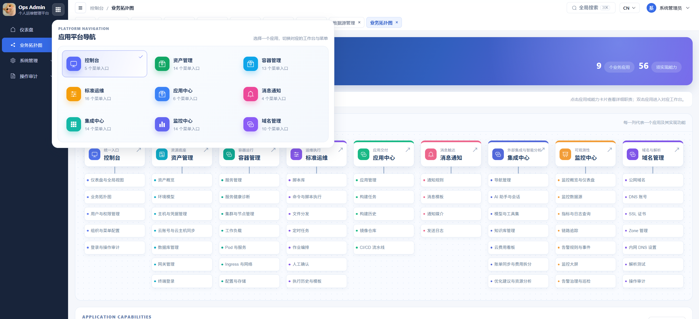
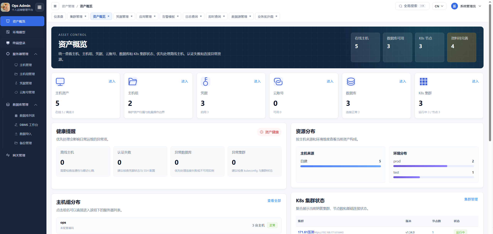
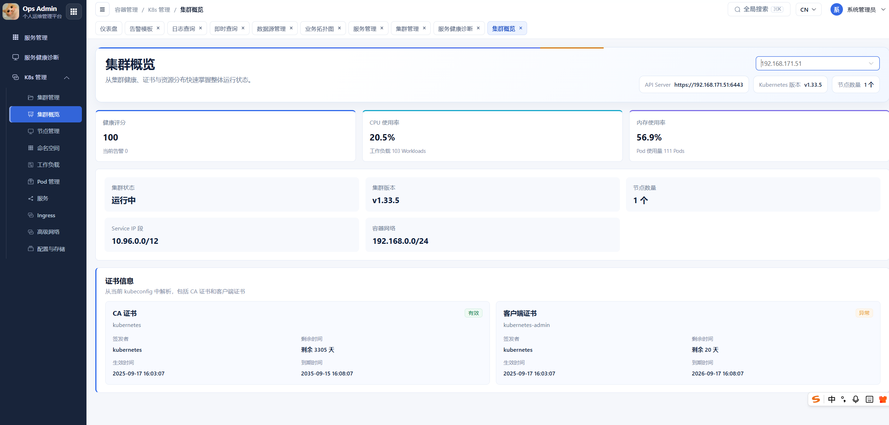
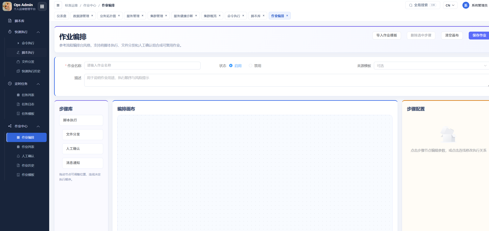
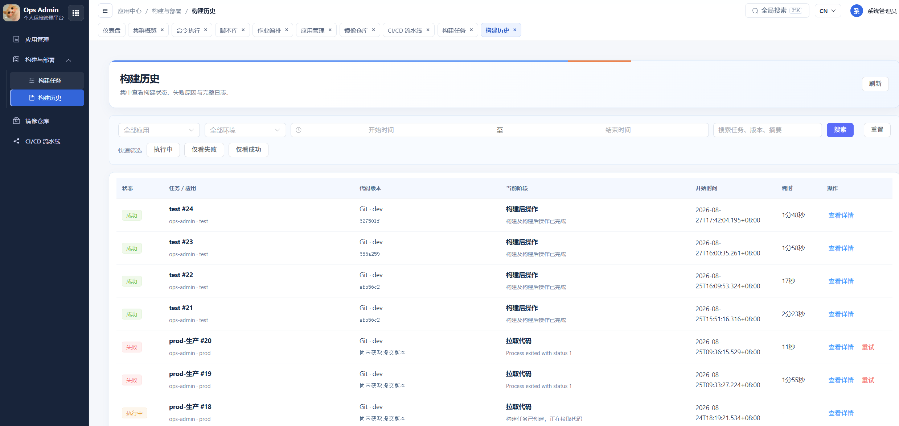
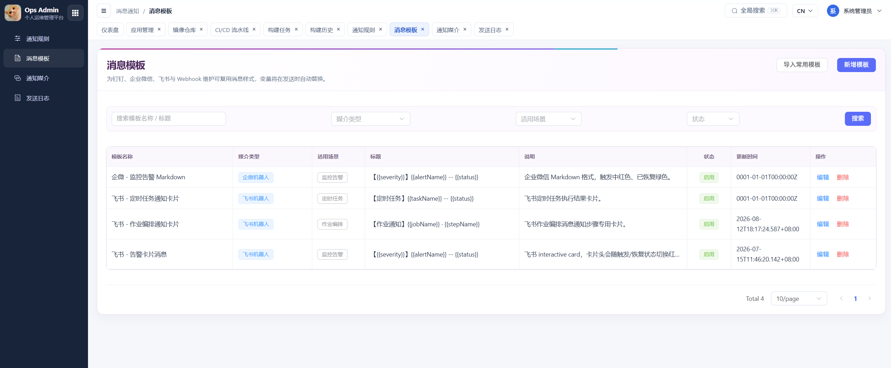
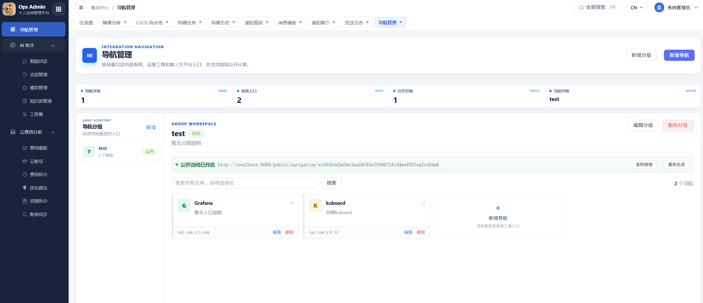
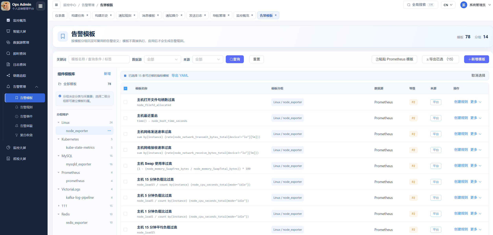
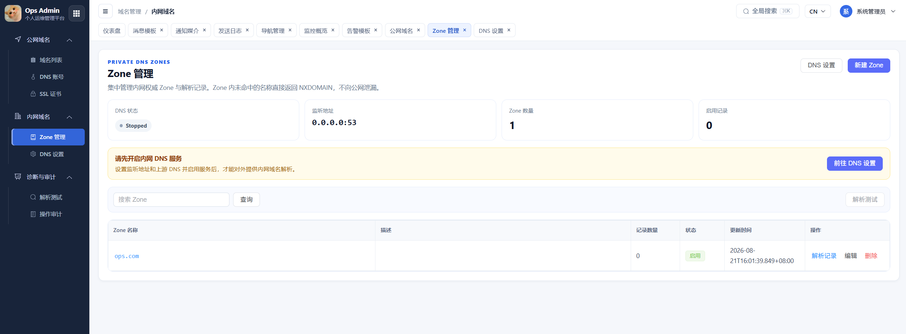

# Ops Admin

Ops Admin은 **Go + Vue 3** 기반의 통합 운영 관리 플랫폼입니다. 중소 규모 운영팀을 대상으로 자산 관리, Kubernetes 관리, 일괄 운영, Job 오케스트레이션, 모니터링·알림, 메시지 통지, CI/CD 배포 기능을 제공합니다.

플랫폼은 **자산, 환경, 애플리케이션, 모니터링, 실행**을 중심으로 기능을 구성하며, SSH Gateway를 통해 내부망의 호스트, 데이터베이스, Kubernetes 클러스터에 접근할 수 있습니다.

## 화면 미리보기

### 애플리케이션 플랫폼 탐색

Console, 자산 관리, 컨테이너 관리, 표준 운영, 애플리케이션 센터, 메시지 통지, 통합 센터, 모니터링 센터, 도메인 관리를 한 화면에서 전환합니다.



### 자산 개요

호스트, 호스트 그룹, Credential, 클라우드 계정, 데이터베이스, Kubernetes 클러스터의 상태와 리소스 분포를 한곳에서 확인합니다.



### Kubernetes 클러스터 개요

클러스터 상태, 리소스 사용량, 네트워크 구성, 인증서 상태를 확인합니다.



### Job 오케스트레이션

스크립트 실행, 파일 배포, 수동 승인, 메시지 통지 단계를 조합해 표준 운영 Job을 구성합니다.



### 빌드 이력

애플리케이션, 환경, 시간 기준으로 빌드 상태, 현재 단계, 소요 시간, 실패 원인을 추적합니다.



### 메시지 템플릿

DingTalk, WeCom, Feishu, Webhook 통지 템플릿을 관리합니다.



### 통합 탐색

내부 시스템, 운영 도구, 외부 플랫폼 진입점을 용도별로 구성합니다.



### Alert 템플릿

데이터 소스와 컴포넌트별로 재사용 가능한 Prometheus Alert 정의를 관리합니다.



### 내부 DNS Zone

내부 Authoritative Zone, DNS Record, DNS 서비스 상태, 작업 감사 로그를 관리합니다.



## 기술 스택

| 계층 | 기술 |
| --- | --- |
| Backend | Go 1.24, Gin, GORM, JWT |
| Database | MySQL 8.x |
| Kubernetes | client-go, Kubernetes API |
| 원격 연결 | SSH, WebSocket |
| Scheduler | robfig/cron v3 |
| Frontend | Vue 3, Vite 5, Vue Router |
| UI | Element Plus |
| 오케스트레이션 Canvas | AntV X6 |
| Web Terminal | XTerm.js |

## 주요 기능

### 자산 관리

- 자산 개요, 호스트 및 호스트 그룹 관리
- SSH Password / SSH Key Credential 관리
- 클라우드 계정 및 호스트 정보 관리
- Web SSH Terminal
- SSH Jump Gateway 관리
- MySQL 데이터베이스 자산 및 DBMS Workbench
- SQL 편집, 자동 완성, 결과 편집, 실행 이력, Rollback SQL
- 데이터베이스 Import / Export Job

### Kubernetes 관리

- Multi-Cluster 등록, 연결 검증, 클러스터 전환
- Direct 연결 또는 SSH Gateway를 통한 API Server 접근
- 클러스터 개요, 인증서 정보, Node 관리
- Namespace, Pod, Workload 관리
- Pod Web Terminal
- Service, Ingress, Gateway API
- ConfigMap, Secret, Storage 리소스 관리
- YAML 조회, 검색, Diff Preview, 변경 확인
- Workload 이미지 버전 일괄 업데이트

### 표준 운영

- Shell, Bat, Perl, Python, PowerShell, SQL 스크립트 라이브러리
- Command 실행, Script 실행, File Distribution
- 호스트와 호스트 그룹 상호 배타 선택
- 동시 실행 수, Timeout, 실시간 실행 결과
- Quick Execution History
- Script Job 및 HTTP Probe Scheduled Task
- Job Template, Job Log, 일괄 활성화/비활성화
- 6필드 Cron Editor: `초 분 시 일 월 요일`
- Visual Job Orchestration
- Script 실행, File Distribution, Manual Approval, Message Notification 단계
- Job Template, Job History, Approval Center

### 애플리케이션 센터

- Git / SVN 애플리케이션 프로젝트 관리
- 애플리케이션, 호스트, Kubernetes, 데이터베이스, 모니터링, 배포 Topology
- Build Task 및 Build History
- Build Stage Log
- CI/CD Pipeline Template 및 Custom Pipeline
- Source Checkout, Test, Build, Container Image Build, Image Push, K8s Deploy
- Go, Maven, Vue 등 주요 Pipeline Template

### 모니터링 및 통지

- Prometheus, VictoriaMetrics 데이터 소스
- PromQL Instant Query
- Alert Rule 및 Alert Event
- Alert Silence, Aggregation, 반복 통지 제어
- Alert 발생 시 진단 Script 또는 운영 Job 실행
- 호스트 및 Kubernetes Monitoring Dashboard
- Inspection Dashboard 및 점검 보고서
- DingTalk, WeCom, Feishu Bot
- Custom HTTP Webhook
- Message Template, Notification Channel, Notification Rule, Send Log

### 플랫폼 관리

- 사용자, Role, 부서, 직무, 메뉴 권한 관리
- Login Log 및 Operation Audit Log
- 한국어 중심 UI
- `dev / test / prod` 환경 모델

## 프로젝트 구조

```text
ops-admin/
├── backend/
│   ├── auth/          # JWT 인증/인가
│   ├── config/        # 설정 로딩
│   ├── controller/    # HTTP Controller
│   ├── middleware/    # 인증, CORS, 작업 로그
│   ├── model/         # GORM 데이터 모델
│   ├── router/        # API Route
│   ├── service/       # 비즈니스 로직
│   ├── store/         # DB 연결, Migration, 초기화
│   ├── util/          # 공통 Utility
│   ├── config.yaml    # Backend 설정
│   └── main.go
├── web/
│   ├── src/api/       # API Wrapper
│   ├── src/composables/
│   ├── src/layouts/   # 플랫폼 Layout
│   ├── src/router/    # Frontend Route
│   ├── src/utils/     # 메뉴, i18n, Utility
│   └── src/views/     # 화면
├── docs/
├── scripts/
├── LICENSE
└── README.md
```

## 실행 환경

- Go `1.24+`
- Node.js `18+` (`20+` 권장)
- npm `9+`
- MySQL `8.x`

사용하는 기능에 따라 다음 환경도 준비해야 합니다.

- 접근 가능한 Linux SSH 호스트
- Kubernetes `kubeconfig`
- Prometheus 또는 VictoriaMetrics
- Git 또는 SVN Client
- Docker, kubectl 등 Pipeline 실행에 필요한 CLI

## 배포

운영 또는 체험 환경에서는 Docker Compose 사용을 권장합니다. 상세 절차는 다음 문서를 참고하십시오.

- [Docker Compose 배포 가이드](docs/DEPLOY_DOCKER_COMPOSE.md)

구성은 독립된 MySQL, API, Web Container를 실행하며 외부에는 Web 포트 `8080`만 노출합니다. 설정, 보안, 검증, Backup, Upgrade, Troubleshooting 절차를 포함합니다.

## 로컬 개발 빠른 시작

### 1. 데이터베이스 생성

```sql
CREATE DATABASE ops_admin
  DEFAULT CHARACTER SET utf8mb4
  COLLATE utf8mb4_general_ci;
```

현재 프로젝트의 Collation은 `utf8mb4_general_ci`입니다. Backend 시작 시 GORM이 Schema Migration과 기본 데이터 초기화를 자동 수행합니다.

### 2. Backend 설정

`backend/config.yaml`을 수정합니다.

```yaml
app:
  name: ops-admin
  port: "8082"
  mode: debug

db:
  host: 127.0.0.1
  port: "3306"
  user: root
  password: "데이터베이스 비밀번호로 변경"
  name: ops_admin
  log-mode: false
```

### 3. Backend 실행

```bash
cd backend
go mod download
go run .
```

기본 Listen 주소:

- API: `http://127.0.0.1:8082`
- Health Check: `http://127.0.0.1:8082/ping`

### 4. Frontend 실행

```bash
cd web
npm install
npm run dev
```

`http://127.0.0.1:8080`에 접속합니다. Vite는 `/api/v1`과 `/uploads`를 Backend의 `8082` 포트로 Proxy합니다.

### 5. 초기 계정

```text
사용자명: admin
비밀번호: 123456
```

최초 로그인 후 기본 비밀번호를 즉시 변경하십시오.

## Cron 규칙

Scheduled Task는 6필드 Cron 형식을 사용합니다.

```text
초 분 시 일 월 요일
```

기본 표현식:

```text
0 */5 * * * *
```

5분마다 0초 시점에 실행됩니다. 전통적인 5필드 표현식도 지원하며, 앞에 `0`초를 자동 추가합니다.

## Gateway 접근

대상 리소스가 내부망에 있는 경우 **자산 관리 → Gateway 관리**에서 SSH Jump Host를 먼저 등록한 뒤 다음 리소스에 Gateway를 지정할 수 있습니다.

- Host SSH
- MySQL Database
- Kubernetes API Server

Gateway 자체는 Ops Admin Backend가 실행되는 서버에서 접근 가능해야 하며, 최종 대상 주소까지 네트워크 연결이 가능해야 합니다.

## 개발 및 검증

Backend Format 및 Test:

```bash
cd backend
go fmt ./...
go test ./...
```

Frontend Production Build:

```bash
cd web
npm run build
```

Build Artifact는 `web/dist/`에 생성됩니다.

## 보안 권장사항

- 운영 환경에서 기본 관리자 비밀번호를 사용하지 마십시오.
- 실제 DB Password, SSH Private Key, Token, kubeconfig를 Git에 Commit하지 마십시오.
- Ops Admin Backend의 운영망 접근 범위를 최소화하십시오.
- 고위험 SQL, 파일 덮어쓰기, K8s YAML 변경, 배포 작업은 이중 확인 절차를 유지하십시오.
- Operation Log, Execution History, Notification Send Log를 정기적으로 점검하십시오.
- HTTPS Reverse Proxy를 통해 플랫폼에 접근하는 것을 권장합니다.
- 운영 환경에서는 Gin debug mode를 비활성화하는 것을 권장합니다.

## 문제 해결

### K8s 클러스터 연결 실패

kubeconfig, API Server 주소, 인증서 유효기간, Backend 네트워크 연결, Gateway 설정을 확인하십시오.

### SSH 실행 실패

Host SSH IP, Port, Username, Credential, Gateway 경로, 서버 Firewall을 확인하십시오.

### 모니터링 화면에 데이터가 없음

데이터 소스 연결 상태를 확인하고 해당 PromQL Metric이 존재하는지 확인하십시오.

### CI/CD Stage 실행 실패

Backend 실행 환경에 Stage 수행에 필요한 Git, SVN, Docker, kubectl, Go, Node.js, Maven이 설치되어 있는지 확인하십시오.

## 문서

- [Docker Compose 배포 가이드](docs/DEPLOY_DOCKER_COMPOSE.md)
- [아키텍처 문서 인덱스](docs/architecture/README.md)
- [플랫폼 UX 리뷰](docs/PLATFORM_UX_REVIEW.md)

## License

이 프로젝트는 [GNU General Public License v3.0](LICENSE)을 따릅니다. 소스 코드 수정·배포 시 해당 라이선스 조건을 준수해야 합니다.
