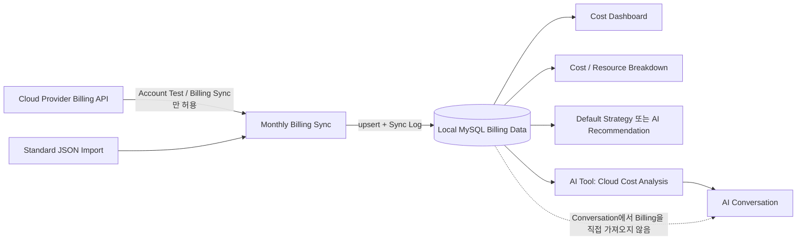

# FinOps 및 AI Data Flow

## 목적

Cloud 비용의 Source, 집계 기준, Access Path를 추적 가능하게 유지합니다. Dashboard, Recommendation, AI Conversation이 Billing Sync Flow를 우회해 Cloud Provider를 직접 호출하지 못하게 합니다.

## 변경 불가 Boundary

| Rule | 설명 |
| --- | --- |
| Cloud Billing 단일 Entry Point | Cloud Account Test와 Billing Sync Service만 Cloud Provider Billing API를 호출할 수 있습니다. |
| Local Consumption | Dashboard, 비용 분석, Resource 비용 분석, 최적화 권고, AI 비용 분석은 MySQL에 저장된 동기화 Billing만 Read합니다. |
| Monthly Sync | 기본적으로 현재 월을 포함한 최근 6개 Calendar Month를 월별로 동기화합니다. 한 달의 실패가 다른 달의 동기화를 중단하지 않습니다. |
| Idempotent Write | 같은 Account의 동일 Billing Record는 upsert하여 중복 Record와 중복 합산을 방지합니다. |
| Current Month 기준 | 현재 월은 미완료 Billing Period일 수 있으므로 Consumer에 Partial 상태를 전달해야 합니다. Monthly Instance Billing을 일별로 표시할 때는 Local Daily Average Estimate임을 명시합니다. |
| AI Permission | `finops_cost_analysis`는 Local Read-only Tool입니다. External State를 변경할 수 있는 Tool은 Human Confirmation이 필요합니다. |

## Main Data Flow

Diagram은 [finops-ai-data-flow.html](finops-ai-data-flow.html)에서 확인합니다.

## Sync Lifecycle

1. 사용자가 Account와 선택적 Billing Month Range를 지정합니다. Range가 없으면 Backend는 현재 월부터 5개월 전까지의 범위를 계산합니다.
2. Service는 각 `YYYY-MM`에 대해 Monthly Sync Execution Record를 생성합니다.
3. 각 월마다 Cloud Provider Billing을 독립적으로 요청하고 Local Cost Record에 저장합니다. Record Count, Amount, Start/End Time, Error Reason은 Sync History에 기록합니다.
4. 특정 월이 실패하면 Failure Log를 저장하고 다음 월 처리를 계속합니다. 전체 Response에는 월별 Status, Record Count, Amount, Error Information을 반환합니다.
5. Page, Optimization Recommendation, AI Query는 이후 Local Cost Record만 Aggregate합니다.

## Consumer 기준

| Consumer | Query Dimension | 핵심 요구사항 |
| --- | --- | --- |
| Cost Dashboard | 3 / 6 / 12 Calendar Month, Account, Provider | 월이 연속되어야 하며 빈 월은 0으로 표시합니다. 현재 월은 Partial 상태를 표시합니다. |
| Cost Breakdown | 단일 Billing Month, Product, Region, Account, Resource, Tag | `month`는 `YYYY-MM`이며 선택한 Calendar Month만 집계합니다. |
| Resource Breakdown | Account, Date Range, Region, Resource Type | Account와 Date Range를 먼저 선택하고 Resource Detail 영역에서 Filter합니다. |
| Optimization Recommendation | Account, Analysis Month, Default / AI Strategy | 이름에 Account와 Billing Month가 포함되어야 하며 Recommendation은 조회, Export, Delete할 수 있어야 합니다. |
| AI Conversation | Account, Billing Month, Product, Region, Resource | Local `finops_cost_analysis`만 호출할 수 있고 Sync 또는 Cloud-side Query를 실행할 수 없습니다. |

## Runtime 및 Audit

- Sync History에는 Account, Trigger Type, Billing Month, Status, Record Count, Synchronized Amount, Duration, Start/Finish Time, Error Information을 저장합니다.
- 특정 월의 Billing API가 성공했지만 Detail을 반환하지 않았다면 Log에 `no billing details returned` 상태를 명확히 기록합니다. 이를 0원 Billing이 존재하는 것으로 오인하지 않습니다.
- AI Tool Call과 Human Confirmation 작업을 Persistence하여 Model이 실제로 Tool을 실행했는지 추적할 수 있어야 합니다.
- Optimization에 사용하는 Amount와 Resource Information은 Local Billing에서만 가져옵니다. 동기화되지 않은 Cloud Real-time Information으로 확정적 결론을 만들지 않습니다.
