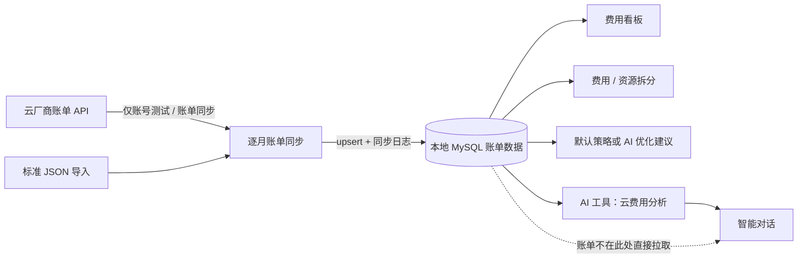

# FinOps 与 AI 数据流

## 目标

保证云费用的来源、口径和访问路径可追溯，并避免看板、建议或 AI 对话绕过同步链路直接访问云厂商。

## 不可变边界

| 规则 | 说明 |
| --- | --- |
| 云账单唯一入口 | 仅“云账号测试”和“账单同步”服务可调用云厂商账单 API。 |
| 本地消费 | 看板、费用拆分、资源拆分、优化建议和 AI 费用分析只读 MySQL 中的已同步账单。 |
| 月度同步 | 默认同步含当前月的最近 6 个自然月，逐月执行；单月失败不影响其他月。 |
| 幂等写入 | 同账号同账单记录通过 upsert 更新，避免重复记录和重复累计。 |
| 当前月口径 | 当前月可不完整，必须向消费端返回部分账期标识；按日展示的月度实例账单是本地日均摊估算。 |
| AI 权限 | `finops_cost_analysis` 是只读本地工具；其他可能变更外部状态的工具必须人工确认。 |

## 主数据流

图形化版本见 [finops-ai-data-flow.html](finops-ai-data-flow.html)。

## 同步生命周期

1. 用户选择账号和可选账期范围；未传范围时后端计算当前月向前 5 个月至当前月。
2. 服务按 `YYYY-MM` 逐月创建同步执行记录。
3. 每月独立请求云厂商账单并写入本地费用记录；记录数、金额、开始/结束时间和错误原因写入同步历史。
4. 单月失败写入失败日志后继续后续月份；整体响应返回每月状态、记录数、金额和错误信息。
5. 页面、优化建议与 AI 查询后续只从本地费用记录聚合数据。

## 消费端口径

| 消费端 | 查询维度 | 关键要求 |
| --- | --- | --- |
| 费用看板 | 3 / 6 / 12 个自然月、账号、厂商 | 连续月份；空月为 0；当前月标识不完整。 |
| 费用拆分 | 单账期、产品、地域、账号、资源、标签 | `month` 为 `YYYY-MM`，只统计所选自然月。 |
| 资源拆分 | 账号、日期范围、地域、资源类型 | 先选账号和日期范围，再在资源明细内筛选。 |
| 优化建议 | 账号、分析账期、默认 / AI 策略 | 名称必须包含账号与账期；建议可查看、导出和删除。 |
| AI 对话 | 账号、账期、产品、地域、资源 | 只能调用本地 `finops_cost_analysis`，不能触发同步或云侧查询。 |

## 运行与审计

- 同步历史保留账号、触发方式、账期、状态、记录数、同步金额、耗时、开始/完成时间与错误信息。
- 若某月账单 API 成功但无明细，日志应明确标注“未返回账单明细”，不得把它误判为已有零金额账单。
- AI 的工具调用和人工确认操作均应持久化，便于追踪模型是否实际执行了工具。
- 用于优化的金额与资源信息必须来源于本地账单；不能基于未同步的云端实时信息给出确定性结论。
