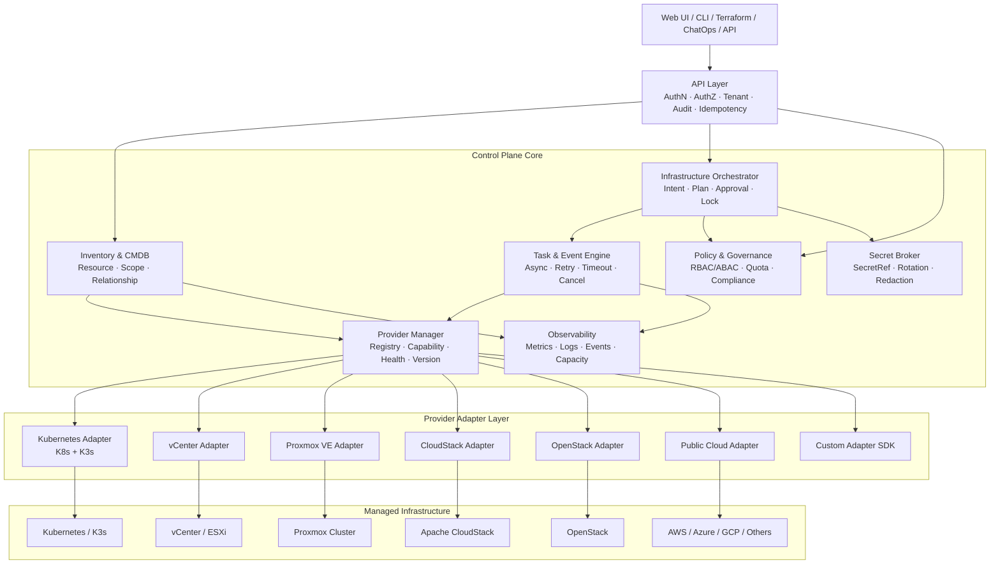
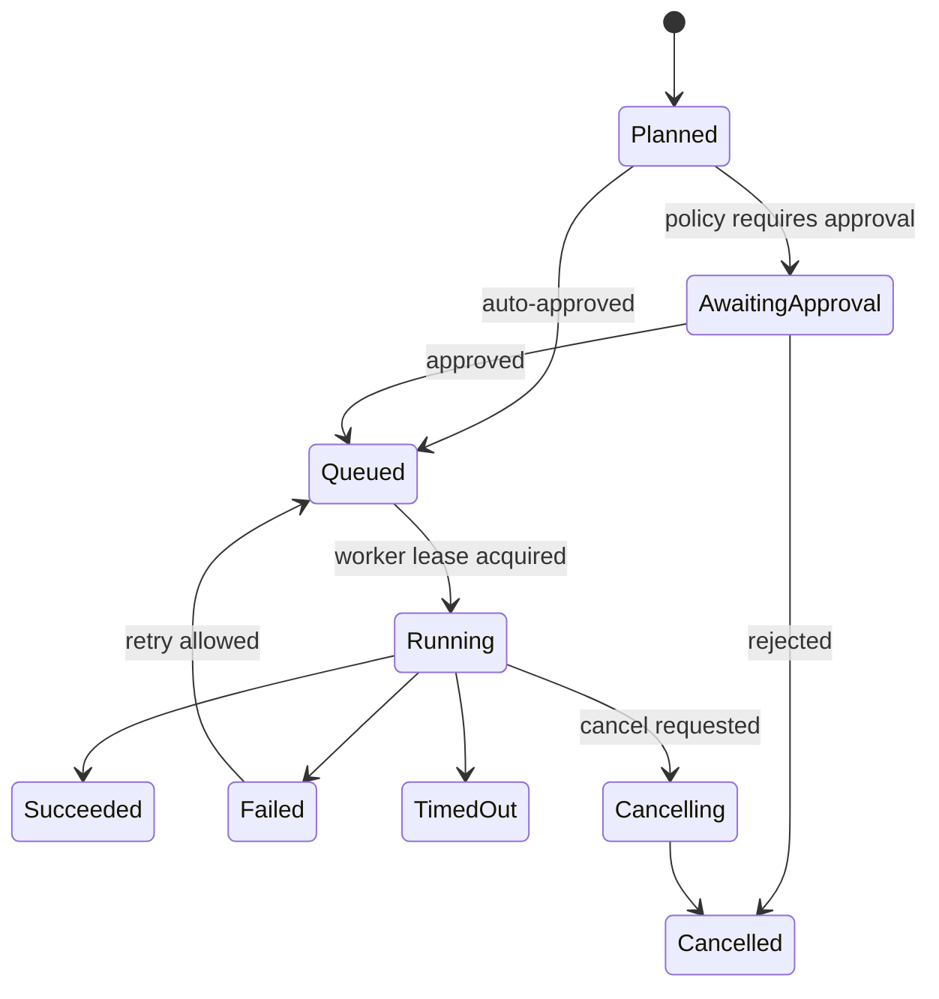

# [Architecture][Epic] Ops Admin 멀티 인프라스트럭처 컨트롤 플레인 전환

> 대상: Kubernetes, K3s, VMware vCenter, Proxmox VE, Apache CloudStack, OpenStack, Public Cloud, On-Premise
>
> 목표: 특정 제품별 관리 기능을 계속 덧붙이는 도구가 아니라, **공통 자원 모델·Capability·비동기 작업·정책·감사 위에 Provider Adapter를 연결하는 확장형 Multi-Infrastructure Control Plane**으로 전환한다.

---

## 1. 결정 요약

현재 코드에 `ProxmoxService`, `VCenterService`, `CloudStackService`를 그대로 추가하는 방식은 금지한다. 기존 Kubernetes 중심 결합을 Provider 수만큼 복제하게 되며, 공유 모델과 UI가 제품별 FK·분기·메뉴로 오염된다.

초기 구현 방식은 다음으로 고정한다.

- Go + Gin + GORM 기반 **모듈형 모놀리스** 유지
- Provider Adapter는 Go 바이너리에 컴파일하고 Registry로 등록
- Core는 제품명이 아니라 `ResourceKind`, `Capability`, `Operation`만 인식
- 읽기 모델은 Inventory Sync로 구성
- 모든 변경 작업은 `ProviderTask`로 추적
- 망 분리 환경에만 선택적 Remote Agent 도입
- Microservice, Kafka, Go `.so` 동적 Plugin은 규모가 증명되기 전 도입 금지

---

## 2. 현재 코드 적대적 검토

### 2.1 `AssetHost`가 물리 Host와 VM을 뒤섞음

`backend/model/asset.go`의 `AssetHost`는 다음을 한 모델에 동시에 보유한다.

- SSH 접속 정보
- OS/CPU/Memory/Disk
- PublicIP/PrivateIP
- Provider/Region/InstanceID
- CloudAccountID
- Gateway/Credential

이 구조로는 아래 대상을 의미적으로 구분할 수 없다.

- Bare-metal Server
- VMware ESXi Host
- CloudStack Host
- Proxmox Node
- QEMU VM
- VMware VM
- CloudStack Instance
- Proxmox LXC
- Kubernetes Node

**결론:** `AssetHost`를 계속 확장하지 않는다. 새 `InfraResource` Shadow Model을 도입해 다음 Kind를 명시적으로 분리한다.

```text
machine.baremetal
compute.node
compute.vm
compute.system_container
orchestration.node
```

### 2.2 `AssetCloudAccount`가 Public Cloud 계정 형식에 고정됨

현재 `AssetCloudAccount`는 `Provider + AccessKey + SecretKey + Regions` 전제를 가진다. 이는 AWS/Aliyun/Tencent에는 맞지만 다음 인증 구조를 제대로 담지 못한다.

- Proxmox API Token + Realm
- vCenter User/Session + Certificate Trust
- CloudStack API Key/Secret + Domain/Account/Project
- OpenStack Application Credential + Project/Domain
- Kubernetes Kubeconfig/ServiceAccount/OIDC

**결론:** `InfraProvider`와 `SecretRef`를 분리한다. Secret 원문을 Provider 테이블과 API 응답에 넣지 않는다.

### 2.3 Kubernetes 전용 FK가 공유 도메인에 박혀 있음

현재 다음 모델은 Kubernetes를 직접 참조한다.

- `AssetService.K8sClusterID`
- `OpsApplicationEnvironmentBinding.K8sClusterID`
- `OpsApplicationEnvironmentBinding.Namespace`
- `OpsApplicationEnvironmentBinding.WorkloadType`
- `OpsApplicationEnvironmentBinding.WorkloadName`

이 패턴을 유지하면 향후 다음 컬럼이 계속 생긴다.

```text
ProxmoxClusterID
VCenterDatacenterID
CloudStackZoneID
OpenStackProjectID
```

**결론:** 애플리케이션·서비스·환경과 인프라의 결합은 `InfraRelationship` 또는 `ResourceBinding`으로 분리한다.

### 2.4 `K8sCluster`가 너무 많은 책임을 가짐

현재 `K8sCluster`에는 Connection, Secret, Gateway, Monitoring Datasource, Inventory Summary, Runtime State가 섞여 있다.

**결론:**

- Connection → `InfraProvider`
- Secret → `SecretRef`
- 위치 계층 → `InfraScope`
- Cluster/Node/Workload → `InfraResource`
- Monitoring 연결 → `ResourceBinding`

K3s는 별도 플랫폼 모델로 복제하지 않는다. Kubernetes Adapter를 공유하고 `distribution=k3s` 및 선택 Capability만 추가한다.

### 2.5 단일 `Service`가 God Object임

`backend/service/service.go`의 단일 `Service`가 Auth, SSH, Gateway, Kubernetes, Scheduler, Monitoring, Backup, FinOps, Notify, DNS, Certificate를 모두 소유한다.

Provider Adapter까지 여기에 넣으면 Cache, Retry, Credential, Task, Lifecycle이 더 얽힌다.

**목표 모듈:**

```text
identity
inventory
provider
orchestration
operations
policy
secrets
observability
finops
notification
```

초기에는 하나의 프로세스와 하나의 배포 단위를 유지하되 패키지 의존 방향을 강제한다.

### 2.6 Router가 모든 도메인을 한 파일에서 등록함

`backend/router/router.go`가 모든 Route와 Permission을 등록한다.

**결론:** 각 모듈이 `RegisterRoutes(group, deps)`를 제공한다. Provider Adapter가 직접 Route를 등록하는 것은 금지한다. Provider 고유 기능은 검증된 Extension Operation으로만 노출한다.

### 2.7 Provider 구현이 Registry가 아니라 Switch문임

기존 DNS/Public Cloud 구현은 Provider 이름을 `switch`로 분기하거나 `service` 패키지에 제품별 API 코드를 직접 둔다.

**결론:** `Descriptor + Factory + Registry` 구조로 교체한다.

### 2.8 기존 작업 모델이 SSH/CI/CD 흐름에 종속됨

`OpsExecTask`, `OpsJob`, `OpsScheduleTask`, `OpsAppPipelineRun`은 존재하지만 다음 Provider 장기 작업을 공통 추적하지 못한다.

- CloudStack Async Job
- Proxmox UPID
- vCenter Task
- OpenStack 상태 전환
- Kubernetes Rollout

**결론:** `ProviderTask`를 독립 도입하고 기존 Ops Job이 ProviderTask를 Step으로 참조한다.

### 2.9 Secret 기본키 Fallback은 Control Plane에 부적합함

현재 Secret 암호화는 환경변수와 개발용 기본키까지 fallback한다.

**결론:** 운영 모드에서 명시적 Master Key 또는 External Secret Backend가 없으면 시작 실패하도록 변경한다.

---

## 3. 목표 아키텍처



### 핵심 원칙

1. Core는 Provider 제품명을 모른다.
2. Adapter는 Core DB를 직접 수정하지 않는다.
3. 조회와 변경을 분리한다.
4. 모든 변경은 감사 가능한 Task다.
5. UI와 API Action은 Capability로 결정한다.
6. 공통 필드는 Canonical Model, Provider 원문은 Raw Snapshot에 보존한다.
7. Scope Tree와 Relationship Graph를 분리한다.
8. K8s와 K3s는 동일 Adapter 계열이다.
9. 새 Provider 추가가 Core Schema 변경으로 이어지면 설계 실패다.

---

## 4. 공통 데이터 모델

### 4.1 `InfraProvider`

```go
type InfraProvider struct {
    ID             uint
    UID            string
    TenantID       uint
    Type           string
    Name           string
    Endpoint       string
    SecretRefID    *uint
    ConfigJSON     JSONMap
    Status         string
    Version        string
    CapabilityHash string
    LastHealthAt   *time.Time
    LastSyncAt     *time.Time
    CreatedAt      time.Time
    UpdatedAt      time.Time
}
```

`ConfigJSON`에는 Secret이 아닌 Provider별 설정만 저장한다. Config는 Adapter가 제공하는 JSON Schema로 검증한다.

### 4.2 `InfraScope`

위치 또는 관리 범위를 표현한다.

```go
type InfraScope struct {
    ID         uint
    UID        string
    ProviderID uint
    ParentID   *uint
    Kind       string
    ExternalID string
    Name       string
    Path       string
    LabelsJSON JSONMap
}
```

Provider별 Scope 예시:

```text
Kubernetes/K3s : provider -> cluster -> namespace
vCenter        : provider -> datacenter -> cluster -> resource_pool/folder
Proxmox        : provider -> cluster -> node
CloudStack     : provider -> region -> zone -> pod -> cluster
OpenStack      : provider -> region -> project -> availability_zone
```

### 4.3 `InfraResource`

```go
type InfraResource struct {
    ID             uint
    UID            string
    ProviderID     uint
    ScopeID        *uint
    ParentID       *uint
    Kind           string
    Subtype        string
    ExternalID     string
    Name           string
    DisplayName    string
    LifecycleState string
    HealthState    string
    ManagedState   string
    LabelsJSON     JSONMap
    SpecJSON       JSONMap
    StatusJSON     JSONMap
    RawJSON        JSONMap
    Revision       string
    LastSeenAt     time.Time
    DeletedAt      *time.Time
}
```

Identity 규칙:

```text
UNIQUE(provider_id, kind, external_id)
```

이름, IP, VM 표시 ID만으로 Identity를 만들지 않는다.

### 4.4 Resource Kind Taxonomy

```text
machine.baremetal
compute.node
compute.vm
compute.system_container
compute.image
compute.template
orchestration.cluster
orchestration.node
orchestration.namespace
orchestration.workload
orchestration.pod
network.segment
network.interface
network.ip
network.load_balancer
storage.pool
storage.volume
storage.snapshot
identity.tenant
identity.project
```

처음부터 Provider의 모든 세부 타입을 Canonical Kind로 승격하지 않는다. 공통 질의와 정책에 필요한 유형만 표준화한다.

### 4.5 `InfraRelationship`

```go
type InfraRelationship struct {
    ID             uint
    ProviderID     uint
    FromResourceID uint
    ToResourceID   uint
    Type           string
    AttributesJSON JSONMap
    LastSeenAt     time.Time
}
```

관계 예시:

```text
VM --runs_on--> ESXi Host
VM --attached_to--> Datastore
Pod --runs_on--> Kubernetes Node
PVC --backed_by--> Storage Volume
Application --deployed_to--> Workload
Instance --member_of--> Project
```

### 4.6 `SecretRef`

```go
type SecretRef struct {
    ID         uint
    Backend    string
    Path       string
    Version    string
    Ciphertext string
    KeyID      string
    RotatedAt  *time.Time
}
```

- `internal`, `vault`, `kubernetes-secret`, `external` Backend 지원
- API Response, Log, Audit에 Secret 원문 금지
- Rotation 및 Version 기록

### 4.7 `ProviderTask`

```go
type ProviderTask struct {
    ID              uint
    UID             string
    ProviderID      uint
    ResourceID      *uint
    Operation       string
    IdempotencyKey  string
    ProviderTaskID  string
    Status          string
    Progress        int
    RequestedBy     uint
    ApprovalPolicy  string
    ErrorCode       string
    ErrorParamsJSON JSONMap
    RequestJSON     JSONMap
    ResultJSON      JSONMap
    StartedAt       *time.Time
    FinishedAt      *time.Time
    LeaseOwner      string
    LeaseExpiresAt  *time.Time
}
```

상태:

```text
queued
awaiting_approval
running
succeeded
failed
cancelling
cancelled
timed_out
```

### 4.8 `InventorySyncRun`

```go
type InventorySyncRun struct {
    ID           uint
    ProviderID   uint
    Mode         string
    Status       string
    Cursor       string
    SeenCount    int
    CreatedCount int
    UpdatedCount int
    MissingCount int
    ErrorCode    string
    StartedAt    time.Time
    FinishedAt   *time.Time
}
```

동기화 안전 규칙:

- 한 번 누락됐다고 Resource를 삭제하지 않음
- N회 연속 미발견 또는 명시적 Delete Event 후 Tombstone
- Provider 장애와 실제 삭제를 구분
- 부분 실패 시 이전 정상 Snapshot 유지
- Full Sync는 Generation을 사용해 원자적으로 Publish

---

## 5. Provider 계약

### 금지

```go
type Provider interface {
    ListVMs()
    CreateVM()
    CreateVPC()
    CreateLXC()
    ListPods()
    MigrateVM()
    // 계속 증가
}
```

이 방식은 Provider마다 빈 구현과 가짜 지원을 만든다.

### 권장

```go
type ProviderAdapter interface {
    Descriptor() Descriptor
    Validate(ctx context.Context, conn Connection) error
    Health(ctx context.Context, conn Connection) Health
    Capabilities(ctx context.Context, conn Connection) ([]Capability, error)
    Discover(ctx context.Context, req DiscoverRequest) (DiscoverPage, error)
    Execute(ctx context.Context, req OperationRequest) (OperationHandle, error)
    Poll(ctx context.Context, handle OperationHandle) (OperationStatus, error)
}
```

```go
type Capability struct {
    Name             string
    Version          string
    ReadOnly         bool
    RequiresApproval bool
    RequestSchema    JSONSchema
    ResultSchema     JSONSchema
    Constraints      JSONMap
}
```

초기 Capability:

```text
inventory.full
inventory.incremental
compute.vm.read
compute.vm.power
compute.vm.create
compute.vm.resize
compute.vm.migrate
compute.vm.snapshot
compute.system_container.read
compute.system_container.power
orchestration.kubernetes.read
orchestration.kubernetes.apply
orchestration.kubernetes.exec
network.segment.read
network.vpc.manage
storage.pool.read
storage.volume.manage
storage.snapshot.manage
console.vnc
console.spice
console.web_terminal
metrics.collect
cost.read
```

UI는 `provider.type === "proxmox"`가 아니라 `hasCapability("compute.vm.migrate")`로 Action을 노출한다.

---

## 6. Provider별 Mapping

### Kubernetes / K3s

- 동일 Kubernetes Adapter 사용
- API Discovery로 지원 Resource 탐지
- K3s는 `distribution=k3s`
- Namespace/Workload/Pod/Service/Ingress/PV/PVC를 Resource로 수집
- K3s host service, embedded datastore 관리는 선택적 Node Agent Capability
- 기존 `backend/service/k8s.go`는 Adapter Facade 뒤에 감싸며 단계적으로 분해

### VMware vCenter

```text
vCenter
  Datacenter
    Cluster
      Resource Pool
      ESXi Host
        VM
    Datastore
    Distributed Switch / Port Group
    Folder / Template
```

- MoRef를 External ID로 사용
- vCenter Task를 `ProviderTaskID`로 추적
- Datastore/Network 연결은 Relationship로 표현
- VM Power/Snapshot/Clone/Migrate는 독립 Capability

### Proxmox VE

```text
Proxmox Cluster
  Node
    QEMU VM
    LXC Container
  Storage
  Bridge / VLAN / SDN
```

- QEMU VM과 LXC를 다른 Kind로 유지
- UPID를 Provider Task ID로 사용
- Quorum/HA와 개별 Resource Health를 분리
- Snapshot/Backup/Migration Capability를 별도 선언

### Apache CloudStack

```text
Region
  Zone
    Pod
      Cluster
        Host
          Instance
    Primary Storage
    Secondary Storage
    Physical Network / Guest Network / VPC
Domain -> Account -> Project
```

- Host와 Instance를 절대 같은 Kind로 합치지 않음
- Async Job ID를 Provider Task와 연결
- Domain/Account/Project는 Provider Scope로 관리
- Primary/Secondary Storage 차이는 Subtype과 Capability로 유지

### OpenStack

```text
Region
  Project
    Availability Zone
      Nova Compute / Server
      Neutron Network / Port / Router
      Cinder Volume / Snapshot
      Glance Image
```

- Keystone Project와 Ops Admin Tenant는 별도 매핑
- Nova/Neutron/Cinder/Glance를 Adapter 내부 Sub-client로 분리

---

## 7. API v2

```text
GET    /api/v2/infrastructure/providers
POST   /api/v2/infrastructure/providers
POST   /api/v2/infrastructure/providers/{id}/validate
POST   /api/v2/infrastructure/providers/{id}/sync
GET    /api/v2/infrastructure/scopes
GET    /api/v2/infrastructure/resources
GET    /api/v2/infrastructure/resources/{uid}
GET    /api/v2/infrastructure/resources/{uid}/relationships
GET    /api/v2/infrastructure/resources/{uid}/capabilities
POST   /api/v2/infrastructure/resources/{uid}/operations/{operation}
GET    /api/v2/infrastructure/tasks/{uid}
POST   /api/v2/infrastructure/tasks/{uid}/approve
POST   /api/v2/infrastructure/tasks/{uid}/cancel
```

Provider 고유 기능은 제한적으로 다음 Extension API를 사용한다.

```text
GET/POST /api/v2/infrastructure/providers/{id}/extensions/{namespace}/{operation}
```

Extension 조건:

- JSON Schema 제공
- Capability 등록
- RBAC/Approval/Audit 적용
- Adapter가 Core DB를 직접 수정하지 않음
- 전용 UI가 없어도 Generic Form으로 실행 가능

---

## 8. UI 구조

현재처럼 Provider마다 정적 메뉴를 계속 추가하지 않는다.

```text
Infrastructure
├── Overview
├── Providers
├── Inventory
│   ├── Compute
│   ├── Kubernetes
│   ├── Network
│   ├── Storage
│   └── Images & Templates
├── Topology
├── Tasks & Approvals
├── Policies
├── Capacity & Cost
└── Audit
```

Resource Detail 공통 Shell:

```text
Summary | Relationships | Metrics | Events | Configuration | Operations | Raw Provider Data
```

Tab과 Action은 Resource Kind 및 Capability에 따라 동적으로 구성한다.

---

## 9. 작업·승인·동시성



필수 규칙:

- Mutating API는 `Idempotency-Key` 필수
- 동일 Resource 충돌 작업은 Resource Lock으로 직렬화
- Provider API Timeout과 Workflow Deadline 분리
- Retry는 Operation별 정책 적용
- Delete, Power Off, Migrate, Network 변경은 정책 기반 승인
- Request/Result는 Secret Redaction 후 Audit 저장
- Worker는 Lease를 사용하고 중복 실행을 방지

---

## 10. 보안·테넌시·감사

- Platform Tenant와 Provider Tenant/Project/Account 분리
- RBAC + Resource Scope ABAC 적용
- Secret 조회 권한과 Resource 작업 권한 분리
- Provider Token 최소 권한 원칙
- TLS 검증 비활성화는 위험 설정 및 감사 대상
- 모든 Operation에 Actor, Tenant, Source IP, Request ID, Resource UID, Provider Task ID 기록
- VNC/SPICE/Web Terminal은 단기 Session Token 사용
- 운영 모드에서 개발용 Credential Master Key fallback 제거

---

## 11. Control Plane 관측성

기본 지표:

```text
provider_health
provider_api_latency_seconds
provider_api_errors_total
inventory_sync_duration_seconds
inventory_sync_resource_changes_total
provider_task_duration_seconds
provider_task_failures_total
worker_queue_depth
worker_lease_expired_total
resource_stale_total
secret_access_total
```

필수 로그 필드:

```text
request_id
trace_id
tenant_id
provider_id
resource_uid
task_uid
operation
error_code
```

---

## 12. 단계별 마이그레이션

### Phase 0 — Architecture Contract

- [ ] ADR: Modular Monolith
- [ ] ADR: Provider Registry 및 Capability
- [ ] ADR: Resource/Scope/Relationship Model
- [ ] ADR: ProviderTask 및 Worker Lease
- [ ] Provider별 Mapping Matrix
- [ ] 공유 모델에 Provider 전용 FK 추가 금지 규칙

### Phase 1 — Core Shadow Schema

- [ ] `InfraProvider`
- [ ] `SecretRef`
- [ ] `InfraScope`
- [ ] `InfraResource`
- [ ] `InfraRelationship`
- [ ] `InventorySyncRun`
- [ ] `ProviderTask`
- [ ] `ProviderEvent`
- [ ] Provider Registry 및 Contract Test Harness

### Phase 2 — Kubernetes/K3s Vertical Slice

- [ ] 기존 `K8sCluster`를 `InfraProvider(type=kubernetes)`로 Backfill
- [ ] 기존 K8s 조회를 Adapter Facade 뒤로 이동
- [ ] K8s/K3s Distribution Detection
- [ ] Namespace/Workload/Pod/Service/Storage Shadow Sync
- [ ] 기존 `/api/v1` 유지 + `/api/v2` 제공
- [ ] Workload Restart를 `ProviderTask`로 실행
- [ ] Approval/Audit/ErrorCode 적용

### Phase 3 — Host/VM 분리

- [ ] `AssetHost`를 Bare-metal/VM으로 분류해 Shadow Resource 생성
- [ ] Public Cloud VM 수집을 Adapter로 이동
- [ ] `AssetCloudAccount`를 `InfraProvider + SecretRef`로 Backfill
- [ ] SSH/Gateway Binding을 Access Profile로 분리

### Phase 4 — Provider Task Engine

- [ ] Queue/Lease
- [ ] Retry/Timeout/Cancel
- [ ] Approval Policy
- [ ] Resource Lock
- [ ] Event Stream 또는 Poll API
- [ ] 기존 Ops Job에서 ProviderTask Step 실행

### Phase 5 — Proxmox VE Adapter

- [ ] Cluster/Node/QEMU/LXC/Storage/Network Read-only Discovery
- [ ] Health/Capability Detection
- [ ] Power Operation
- [ ] Snapshot/Backup/Migration
- [ ] UPID Task Polling
- [ ] Console Session Broker

### Phase 6 — VMware vCenter Adapter

- [ ] Datacenter/Cluster/Resource Pool/ESXi/VM Discovery
- [ ] Datastore/Network/Template Discovery
- [ ] Power/Snapshot/Clone/Migrate
- [ ] vCenter Task/Event Tracking
- [ ] Console Session Broker

### Phase 7 — CloudStack Adapter

- [ ] Region/Zone/Pod/Cluster/Host Discovery
- [ ] Domain/Account/Project Mapping
- [ ] Instance/Storage/Network/VPC Discovery
- [ ] Async Job Polling
- [ ] Power/Deploy/Snapshot/Volume/Network Operation

### Phase 8 — OpenStack/Public Cloud

- [ ] Keystone/Nova/Neutron/Cinder/Glance Adapter
- [ ] 기존 Aliyun/Tencent 코드 Adapter 전환
- [ ] AWS/Azure/GCP Capability 단위 추가

### Phase 9 — Legacy 제거

- [ ] Read Path를 v2 Inventory로 전환
- [ ] Dual-write 종료
- [ ] Provider 전용 FK Deprecation
- [ ] `AssetCloudAccount` 제거 또는 Compatibility View 전환
- [ ] 대형 `Service`와 `Router` 분해

---

## 13. 권장 PR 분할

1. `docs(architecture): add multi-infrastructure ADR and taxonomy`
2. `feat(infra): add provider and secret reference models`
3. `feat(inventory): add scope, resource and relationship graph`
4. `feat(provider): add registry and capability contracts`
5. `feat(task): add provider task engine and worker lease`
6. `refactor(k8s): wrap current Kubernetes implementation as adapter`
7. `feat(inventory): backfill current K8s and host assets`
8. `feat(proxmox): add read-only inventory adapter`
9. `feat(proxmox): add guarded operations and task polling`
10. `feat(vcenter): add inventory adapter`
11. `feat(cloudstack): add topology and async-job adapter`

기존 모델 교체와 여러 Provider 구현을 한 PR에 넣지 않는다.

---

## 14. 금지사항

- [ ] Provider마다 별도 메뉴·Controller·Service·Table을 복제
- [ ] 모든 기능을 하나의 거대 Provider Interface에 추가
- [ ] 검증 없는 JSON 컬럼 하나로 전체 CMDB 구성
- [ ] 이름/IP를 Cross-provider Identity로 사용
- [ ] Provider API 접수 성공을 작업 완료로 간주
- [ ] Go Dynamic Plugin `.so` 채택
- [ ] 처음부터 Microservice/Kafka/분산 Lock 도입
- [ ] Terraform을 실시간 운영 API 대체재로 사용
- [ ] K3s를 Kubernetes와 별도 제품 모델로 복제
- [ ] CloudStack Host와 VM Instance를 같은 Host 모델로 병합
- [ ] Secret 또는 Provider 원문 오류를 UI/Log/Audit에 노출

---

## 15. 완료 조건

### 구조

- [ ] 새 Provider 추가 시 Core DB Schema 변경이 필요 없음
- [ ] 공유 Domain Model에 Provider 전용 FK가 없음
- [ ] 물리 Node, VM, System Container, Kubernetes Node가 구분됨
- [ ] Scope Tree와 Relationship Graph가 분리됨
- [ ] UI Action이 Provider 이름이 아니라 Capability로 결정됨

### 운영

- [ ] 모든 변경 작업이 `ProviderTask`로 추적됨
- [ ] Approval, Idempotency, Lock, Retry, Timeout, Cancellation 동작
- [ ] Sync 장애가 Resource 대량 삭제로 이어지지 않음
- [ ] Provider Task ID와 Ops Admin Task UID가 연결됨

### 보안

- [ ] 운영 모드에 개발용 Secret Key fallback 없음
- [ ] Secret이 API/Log/Audit에서 Redaction됨
- [ ] Tenant/Provider Scope 기반 권한 검증 적용
- [ ] 모든 변경에 Actor/Resource/Provider/Task Audit 존재

### 호환성

- [ ] 기존 Kubernetes 기능 회귀 없음
- [ ] Migration 기간 `/api/v1` 유지
- [ ] K8s와 K3s가 같은 Core Adapter Contract 사용
- [ ] Proxmox/vCenter/CloudStack 추가 시 Core Module 수정 최소화

### 품질

- [ ] Provider Contract Test Suite
- [ ] Fake Adapter 기반 Sync/Task 통합 테스트
- [ ] Rate Limit, Timeout, 부분 실패, 중복 Event 테스트
- [ ] `go test ./...` 통과
- [ ] Frontend Production Build 통과
- [ ] Architecture Boundary CI 통과

---

## 16. 첫 구현 검증 범위

이 Epic의 첫 목표는 모든 Provider를 한 번에 만드는 것이 아니다. 다음 Vertical Slice로 Architecture Contract를 먼저 검증한다.

```text
기존 Kubernetes/K3s 기능
  -> Provider Registry 등록
  -> InfraProvider Connection
  -> Scope/Resource/Relationship Shadow Inventory
  -> Capability 기반 조회
  -> Workload Restart 1개 작업을 ProviderTask로 실행
  -> Approval/Audit/ErrorCode 적용
```

두 번째 Adapter로 Proxmox VE Read-only Inventory를 추가한다. 이때 Core Schema와 공통 UI를 크게 수정해야 한다면 Architecture Contract가 실패한 것이므로 vCenter/CloudStack 구현 전에 다시 설계한다.
