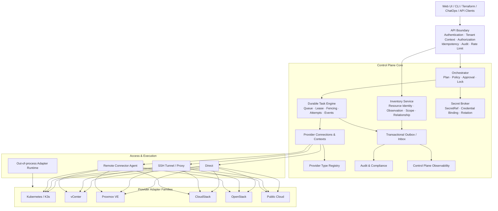
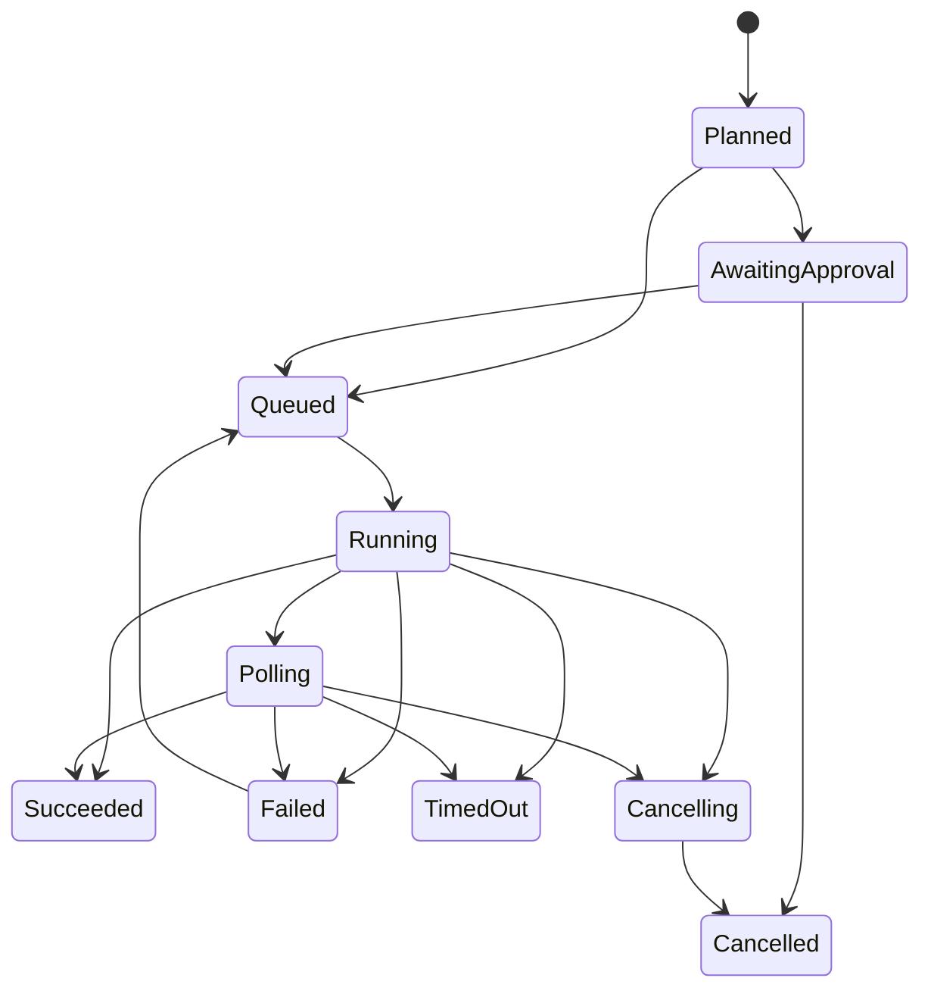

# Ops Admin Multi-Infrastructure Control Plane V2

> Tracking issue: #4
>
> Target platforms: Kubernetes, K3s, VMware vCenter, Proxmox VE, Apache CloudStack, OpenStack, public cloud, and on-premises infrastructure.

## 1. Decision

The existing V1 architecture document is not an implementation contract. It identified the right direction—provider adapters, common resources, capabilities, and asynchronous tasks—but did not sufficiently account for the security, authorization, durability, scheduling, connectivity, and migration constraints already present in the codebase.

The V2 decision is:

- Keep a **modular monolith** during the first transformation stages.
- Separate provider type, provider connection, provider context, and platform tenant binding.
- Treat inventory observation and desired intent as different models.
- Represent topology with scope graphs, resource relationships, and scope memberships rather than one parent tree.
- Execute every infrastructure mutation through a durable task engine.
- Make capability and operation definitions the source of truth for UI actions, authorization, risk, approval, auditing, retry, and redaction.
- Support direct, tunnel, proxy, and remote-agent access routes from the beginning.
- Keep built-in adapters in process; run third-party adapters out of process over a versioned mTLS protocol.
- Do not implement Proxmox, vCenter, CloudStack, or OpenStack mutations until the security baseline and durable task engine are complete.

---

## 2. Adversarial review of the current code

### 2.1 `AssetHost` conflates incompatible resource types

`backend/model/asset.go` stores SSH access, OS and capacity, public/private IPs, provider, region, instance ID, cloud account, gateway, and credential on one `AssetHost` record.

That model cannot safely distinguish:

- bare-metal server
- hypervisor node
- VMware ESXi host
- CloudStack host
- Proxmox node
- public-cloud virtual machine
- VMware virtual machine
- CloudStack instance
- Proxmox QEMU VM
- Proxmox LXC container
- Kubernetes node

**Decision:** Do not add more provider-specific fields to `AssetHost`. Introduce a shadow `InfraResource` inventory and migrate resource identities into explicit kinds.

### 2.2 `AssetCloudAccount` assumes one public-cloud credential shape

The current account model assumes `provider + access key + secret key + regions`. It cannot faithfully model:

- Proxmox API token and realm
- vCenter user/session and certificate trust
- CloudStack API key/secret plus domain/account/project
- OpenStack application credential plus domain/project
- Kubernetes kubeconfig, service account, or OIDC

**Decision:** Replace the conceptual role of `AssetCloudAccount` with separate provider connection, context, and credential-binding models. The legacy table remains only during migration.

### 2.3 Kubernetes-specific foreign keys leak into shared domains

Current shared models directly store Kubernetes-specific fields, including:

- `AssetService.K8sClusterID`
- `OpsApplicationEnvironmentBinding.K8sClusterID`
- `Namespace`
- `WorkloadType`
- `WorkloadName`

Extending this pattern would produce `ProxmoxClusterID`, `VCenterDatacenterID`, `CloudStackZoneID`, and similar provider-specific columns.

**Decision:** Application, service, environment, monitoring, database, and infrastructure associations must use typed bindings or relationships instead of provider-specific foreign keys.

### 2.4 `K8sCluster` mixes connection, secret, runtime, inventory, and monitoring

The current cluster record includes endpoint, kubeconfig, gateway, monitoring datasource, version, node count, state, and sync timestamps.

**Decision:** Split responsibilities as follows:

```text
connection and endpoint  -> ProviderConnection
account/project/cluster  -> ProviderContext
secret material          -> SecretRef + CredentialBinding
location/ownership       -> Scope + ScopeMembership
cluster/node/workload    -> InfraResource + Observation
monitoring attachment    -> Typed Binding/Relationship
```

K3s is a Kubernetes distribution, not a duplicate platform model. It uses the Kubernetes adapter family with `distribution=k3s` and optional node-agent capabilities.

### 2.5 The central `Service` is a God object

The current service owns authentication, SSH, gateway connections, Kubernetes clients and caches, operations scheduling, monitoring scheduling, backup scheduling, FinOps scheduling, notification dispatching, DNS, and certificate runtime state.

Adding multiple provider clients and workers to the same object would multiply shared mutable state and lifecycle coupling.

**Decision:** Split packages and dependencies into explicit modules while keeping one process initially:

```text
identity
access
secrets
provider
inventory
orchestration
tasks
policy
audit
operations
observability
finops
notification
```

### 2.6 Router and permissions are monolithic

`backend/router/router.go` registers a large set of unrelated routes. Many sensitive routes are protected only by authentication and not by resource-scoped authorization.

**Decision:**

- Each module exposes `RegisterRoutes(group, dependencies)`.
- Every route declares an operation definition.
- Infrastructure permissions are enforced server-side using tenant, provider context, resource scope, resource kind, environment, and operation.
- UI directives are not security boundaries.

### 2.7 Provider selection is implemented with switches

Existing DNS and cloud discovery logic selects implementations by provider-name switches and keeps provider API code inside the service package.

**Decision:** Introduce a registry of versioned descriptors and factories. Core code may reference adapter interfaces and capability names but not provider product names.

### 2.8 Existing asynchronous execution is not durable

Current operations can create records and then execute work in process-local goroutines. A process crash can leave records in `running` state without recovery. Multiple API replicas can also start the same scheduler set.

**Decision:**

- API handlers only create commands/tasks.
- Workers claim tasks using database leases and fencing tokens.
- Schedulers enqueue tasks but never perform business work directly.
- Task attempts and events are persisted.
- Recovery reconciles stale leases after process loss.

### 2.9 Current audit logging is insufficient for an infrastructure control plane

Current auditing largely derives risk and descriptions from HTTP path strings and ignores GET requests. This misses mutating GET endpoints and cannot distinguish operations behind a generic provider-operation URL.

**Decision:** Operation definitions, not route strings, define:

- mutation status
- risk level
- required permission
- approval policy
- redaction schema
- idempotency policy
- retry policy
- timeout policy
- audit event type

### 2.10 Current secret handling is not acceptable for provider credentials

Credential and cloud-account models can contain password, private key, passphrase, access key, and secret key fields. The current secret utility has environment and fixed development fallbacks, and the repository contains example values that must never be treated as production-safe.

**Decision:** Complete secret migration and key rotation before adding provider credentials.

---

## 3. Security prerequisite: Phase -1

No new provider mutation is allowed until all Phase -1 controls are complete.

### 3.1 Secret containment

- Remove secret-bearing fields from API response models.
- Encrypt existing plaintext secrets with a versioned envelope format.
- Rotate any repository-exposed database password or credential master key.
- Fail startup in production when no explicit master key or external secret backend exists.
- Store only secret references in provider records.
- Support purpose-specific credentials: inventory, operations, billing, console, monitoring, and backup.
- Redact secrets by schema, not only by a list of string keys.

### 3.2 Authorization containment

- Apply explicit permissions to all sensitive `/api/v1` routes before exposing `/api/v2`.
- Introduce a resource-aware policy input:

```text
actor
tenant
provider_connection
provider_context
resource_uid
resource_kind
resource_labels
environment
operation
risk_level
approval_state
```

### 3.3 Console and terminal containment

Main access tokens must not be placed in URLs.

```text
POST /api/v2/console-sessions
  -> authenticate normal request
  -> authorize resource + protocol
  -> apply approval policy
  -> create one-time ticket with short expiry

WSS /api/v2/console/connect?ticket=...
  -> atomically consume ticket
  -> bind to one resource and protocol
```

### 3.4 Mutation semantics

- Remove or convert mutating GET endpoints.
- Require `Idempotency-Key` for mutations.
- Require `If-Match` or equivalent resource revision for destructive updates where supported.
- Persist actor, request ID, trace ID, operation, resource revision, policy version, approval, and task UID.

### 3.5 CI baseline

Required checks must include:

- `go test ./...`
- race-focused tests for task/lease code
- frontend production build
- migration test on a clean database and an upgraded fixture
- secret scanning
- authorization route coverage
- architecture-boundary checks
- localization guards

---

## 4. Target architecture



### Architectural rules

1. Core does not switch on provider product names.
2. Adapters never write control-plane tables directly.
3. Discovery and mutation are separate paths.
4. A discovered resource is not automatically managed.
5. Every mutation creates a durable task even when the provider returns immediately.
6. Capabilities control UI, API validation, authorization, approval, retry, and polling.
7. Provider-native payloads are preserved as bounded, redacted observations; common queries use normalized fields.
8. Scope and resource relationships are graphs, not one universal hierarchy.
9. Cross-provider relationships are first-class.
10. Built-in and third-party adapter trust boundaries are different.

---

## 5. Core domain model

### 5.1 Provider type descriptor

Describes software support, not a configured endpoint.

```go
type ProviderTypeDescriptor struct {
    Type              string
    AdapterVersion    string
    ProtocolVersion   string
    ConfigSchema      JSONSchema
    ContextKinds      []string
    BuiltIn           bool
}
```

Examples:

```text
kubernetes
vcenter
proxmox
cloudstack
openstack
aws
azure
gcp
```

### 5.2 Provider connection

Represents one reachable control endpoint and transport.

```go
type ProviderConnection struct {
    ID             uint
    UID            string
    ProviderType   string
    Name           string
    Endpoint       string
    AccessRouteID  uint
    TLSProfileID   *uint
    ConfigJSON     JSONMap
    Status         string
    Version        string
    CapabilityHash string
    LastHealthAt   *time.Time
    CreatedAt      time.Time
    UpdatedAt      time.Time
}
```

Secret values are forbidden in `ConfigJSON`.

### 5.3 Provider context

Represents a provider-native administrative scope behind a connection.

```go
type ProviderContext struct {
    ID           uint
    UID          string
    ConnectionID uint
    ParentID     *uint
    Kind         string // cluster, account, project, subscription, organization
    ExternalID   string
    Name         string
    Status       string
    MetadataJSON JSONMap
}
```

Examples:

- Kubernetes cluster context
- CloudStack domain/account/project
- OpenStack domain/project
- vCenter server or linked-mode context
- public-cloud account/subscription/project

### 5.4 Platform tenant binding

Provider-native tenancy must not be equated with Ops Admin tenancy.

```go
type ProviderTenantBinding struct {
    TenantID          uint
    ProviderContextID uint
    Role              string
    PolicySetID       *uint
}
```

### 5.5 Credential binding

A connection may use multiple credentials for different purposes.

```go
type ProviderCredentialBinding struct {
    ID                   uint
    ProviderConnectionID uint
    ProviderContextID    *uint
    Purpose              string // inventory, operations, billing, console, monitoring, backup
    SecretRefID          uint
    Status               string
    LastValidatedAt      *time.Time
}
```

### 5.6 Secret reference

```go
type SecretRef struct {
    ID         uint
    UID        string
    Backend    string // internal, vault, kubernetes_secret, external
    Path       string
    Version    string
    KeyID      string
    Ciphertext string // internal backend only
    RotatedAt  *time.Time
    CreatedAt  time.Time
    UpdatedAt  time.Time
}
```

Secrets are never serialized through normal model JSON responses.

---

## 6. Scope and tenancy graph

A single parent tree cannot represent location, ownership, billing, organization, and execution at once.

### 6.1 Scope

```go
type InfraScope struct {
    ID            uint
    UID           string
    Dimension     string // location, ownership, tenancy, organization, execution
    Kind          string
    ExternalID    string
    Name          string
    MetadataJSON  JSONMap
}
```

### 6.2 Scope relationships

```go
type ScopeRelationship struct {
    ID          uint
    FromScopeID uint
    ToScopeID   uint
    Type        string // contains, member_of, dedicated_to, inherits_from
    Source      string
}
```

### 6.3 Resource scope memberships

```go
type ResourceScopeMembership struct {
    ResourceID uint
    ScopeID    uint
    Role       string // located_in, owned_by, billed_to, managed_by, visible_to
    Source     string
}
```

Provider examples:

```text
Kubernetes/K3s
  location: cluster
  tenancy: namespace

vCenter
  location: datacenter -> cluster
  organization: folders
  execution: resource pool

Proxmox
  location: cluster -> node
  organization: pools

CloudStack
  location: region -> zone -> pod -> cluster
  tenancy: domain -> account -> project

OpenStack
  location: region -> availability zone
  tenancy: domain -> project
```

Paths may be materialized for search but are not authoritative.

---

## 7. Resource identity, observations, and intent

### 7.1 Canonical resource

```go
type InfraResource struct {
    ID             uint
    UID            string
    ContextID      uint
    Kind           string
    Subtype        string
    ExternalID     string
    ExternalURN    string
    Name           string
    DisplayName    string
    LifecycleState string
    HealthState    string
    ManagedState   string // discovered, imported, managed, orphaned, tombstoned
    LabelsJSON     JSONMap
    FirstSeenAt    time.Time
    LastSeenAt     time.Time
    DeletedAt      *time.Time
}
```

Identity rule:

```text
UNIQUE(provider_context_id, kind, external_urn)
```

`ExternalURN` must include enough native scope to avoid collisions. Names and IP addresses are never primary identities.

### 7.2 Observation

```go
type ResourceObservation struct {
    ID                uint
    ResourceID        uint
    GenerationUID     string
    ObservationHash   string
    NormalizerVersion string
    NormalizedJSON    JSONMap
    RawJSON           JSONMap
    ObservedAt        time.Time
}
```

Rules:

- Raw payloads have size limits and redaction.
- Normalizer version changes can trigger re-normalization.
- Partial sync generations are not published.
- Old observations follow retention policy.

### 7.3 Intent

```go
type ResourceIntent struct {
    ID                  uint
    ResourceID          uint
    Operation           string
    DesiredJSON         JSONMap
    SchemaVersion       string
    Generation          int64
    LastAppliedRevision string
    PolicySetID         *uint
    CreatedBy           uint
    CreatedAt           time.Time
    UpdatedAt           time.Time
}
```

`discovered != managed`. An observation does not grant mutation capability.

### 7.4 Resource relationships

```go
type InfraRelationship struct {
    ID             uint
    FromEntityUID  string
    ToEntityUID    string
    Type           string
    Source         string // discovery, user, policy, application_binding
    GenerationUID  string
    Confidence     int
    ManagedBy      string
    AttributesJSON JSONMap
    LastSeenAt     time.Time
}
```

No single `ProviderID` is stored because relationships may cross providers and domains.

Examples:

```text
VM --runs_on--> Hypervisor Node
VM --attached_to--> Datastore
Pod --runs_on--> Kubernetes Node
PVC --backed_by--> Volume
Application --deployed_to--> Workload
Database --runs_on--> VM
DNS Record --points_to--> Public IP
Backup Task --protects--> Proxmox VM
```

### 7.5 Resource kind taxonomy

Initial common kinds:

```text
machine.baremetal
compute.hypervisor_node
compute.vm
compute.system_container
compute.image
compute.template
orchestration.cluster
orchestration.node
orchestration.namespace
orchestration.workload
orchestration.pod
network.segment
network.interface
network.ip
network.router
network.load_balancer
storage.pool
storage.datastore
storage.volume
storage.snapshot
identity.domain
identity.account
identity.project
```

Provider-native details remain subtypes or observation fields unless common policy and query use cases justify standardization.

---

## 8. Inventory synchronization

### 8.1 Sync generation

```go
type InventorySyncRun struct {
    ID              uint
    UID             string
    ConnectionID    uint
    ContextID       uint
    Mode            string // full, incremental, targeted
    Status          string
    Cursor          string
    SeenCount       int
    CreatedCount    int
    UpdatedCount    int
    MissingCount    int
    ErrorCode       string
    StartedAt       time.Time
    CommittedAt     *time.Time
    FinishedAt      *time.Time
}
```

### 8.2 Publication rules

- A full generation becomes authoritative only after all pages complete.
- An incomplete generation does not modify visibility of the previous complete generation.
- A resource is marked stale only after repeated absence in complete generations.
- A tombstone requires a provider delete event or a configurable stale threshold and grace period.
- Provider outage is not resource deletion.
- Every normalized record carries a generation and observation hash.
- Adapter cursors and rate-limit state are persisted.

### 8.3 Reconciliation outcomes

```text
created
updated
unchanged
stale_candidate
tombstoned
identity_conflict
normalization_failed
permission_denied
rate_limited
partial
```

---

## 9. Capability and operation contracts

### 9.1 Capability

```go
type Capability struct {
    Name              string
    Version           string
    ResourceKinds     []string
    ReadOnly          bool
    RequestSchema     JSONSchema
    ResultSchema      JSONSchema
    ConstraintsJSON   JSONMap
}
```

Initial names:

```text
inventory.full
inventory.incremental
compute.vm.read
compute.vm.power
compute.vm.create
compute.vm.resize
compute.vm.migrate
compute.vm.snapshot
compute.system_container.read
compute.system_container.power
orchestration.kubernetes.read
orchestration.kubernetes.apply
orchestration.kubernetes.exec
network.segment.read
network.vpc.manage
storage.pool.read
storage.volume.manage
storage.snapshot.manage
console.vnc
console.spice
console.web_terminal
metrics.collect
cost.read
```

### 9.2 Operation definition

```go
type OperationDefinition struct {
    Name               string
    Version            string
    ResourceKinds      []string
    RequiredCapability string
    RequiredPermission string
    Mutating           bool
    RiskLevel          string
    RequiresApproval   bool
    IdempotencyPolicy  string
    LockScope          string
    TimeoutSeconds     int
    RetryPolicy        RetryPolicy
    RequestSchema      JSONSchema
    ResultSchema       JSONSchema
    RedactionSchema    JSONSchema
}
```

The operation definition is the source of truth for authorization, audit, UI, policy, and execution.

---

## 10. Adapter interfaces

Do not create one mandatory interface containing every feature.

```go
type BaseAdapter interface {
    Descriptor() ProviderTypeDescriptor
    Validate(ctx context.Context, connection ConnectionView) error
    Health(ctx context.Context, connection ConnectionView) HealthResult
    Close() error
}

type Discoverer interface {
    Discover(ctx context.Context, req DiscoverRequest) (DiscoverPage, error)
}

type OperationExecutor interface {
    Execute(ctx context.Context, req OperationRequest) (OperationHandle, error)
}

type TaskPoller interface {
    Poll(ctx context.Context, handle OperationHandle) (OperationStatus, error)
}

type TaskCanceller interface {
    Cancel(ctx context.Context, handle OperationHandle) error
}

type EventSubscriber interface {
    Subscribe(ctx context.Context, cursor string) (EventStream, error)
}

type ConsoleBroker interface {
    OpenConsole(ctx context.Context, req ConsoleRequest) (ConsoleSession, error)
}
```

Registry validation rules:

- A declared capability must map to an implemented interface.
- Operation schemas are immutable within a version.
- Adapter protocol versions are checked at startup/enrollment.
- Adapters do not receive unrestricted database handles.
- Secret broker issues only purpose-scoped, short-lived secret material.

### 10.1 Built-in adapters

Built-in adapters are compiled into the Go binary and registered explicitly.

### 10.2 Third-party adapters

Third-party/customer adapters run out of process:

```text
Control Plane <-> versioned gRPC over mTLS <-> Adapter Runtime
```

They receive scoped requests, never database credentials, and are subject to process, memory, network, timeout, and capability restrictions.

---

## 11. Access routes and remote agents

### 11.1 Access route

```go
type AccessRoute struct {
    ID           uint
    UID          string
    Type         string // direct, ssh_tunnel, http_proxy, remote_agent
    GatewayID    *uint
    AgentID      *uint
    ProxyURL     string
    TLSProfileID *uint
    ConfigJSON   JSONMap
    Status       string
}
```

### 11.2 Connector agent

```go
type ConnectorAgent struct {
    ID              uint
    UID             string
    Site            string
    Version         string
    ProtocolVersion string
    Status          string
    Capabilities    JSONMap
    CertificateID   string
    LastHeartbeatAt time.Time
    CreatedAt       time.Time
    UpdatedAt       time.Time
}
```

Agent requirements:

- one-time enrollment token
- mTLS certificate issuance, rotation, and revocation
- connection/context affinity
- heartbeat and compatibility negotiation
- task claim with lease and fencing token
- no standing plaintext provider secrets
- short-lived secret delivery
- offline and cancellation policy
- console session routing
- upgrade compatibility window
- explicit capability allowlist

---

## 12. Durable task engine

### 12.1 Task

```go
type ProviderTask struct {
    ID                     uint
    UID                    string
    TenantID               uint
    ProviderConnectionID   uint
    ProviderContextID      uint
    ResourceUID            string
    Operation              string
    OperationVersion       string
    IdempotencyKey         string
    RequestHash            string
    PlanHash               string
    ProviderTaskID         string
    Status                 string
    Progress               int
    RequestedBy            uint
    PolicyVersion          string
    ApprovalPolicyVersion  string
    ResourceRevision       string
    ErrorCode              string
    ErrorParamsJSON        JSONMap
    RequestJSON            JSONMap
    ResultJSON             JSONMap
    MaxAttempts            int
    NextAttemptAt          *time.Time
    CancelRequestedAt      *time.Time
    StartedAt              *time.Time
    FinishedAt             *time.Time
    CreatedAt              time.Time
    UpdatedAt              time.Time
}
```

### 12.2 Task attempt

```go
type TaskAttempt struct {
    ID            uint
    TaskID        uint
    AttemptNo     int
    WorkerID      string
    LeaseExpiresAt time.Time
    HeartbeatAt   time.Time
    FencingToken  int64
    Status        string
    ErrorCode     string
    StartedAt     time.Time
    FinishedAt    *time.Time
}
```

### 12.3 Task event

```go
type TaskEvent struct {
    ID        uint
    TaskID    uint
    Sequence  int64
    Type      string
    DataJSON  JSONMap
    CreatedAt time.Time
}
```

### 12.4 Supporting records

```text
ApprovalRequest
ApprovalDecision
IdempotencyRecord
ResourceLock
OutboxEvent
InboxEvent
```

### 12.5 Required behavior

- DB-backed queue initially; no Kafka requirement.
- Claim with lease and fencing token.
- Compare-and-swap task version on every transition.
- Heartbeat long-running tasks.
- Retry only when the operation definition permits it.
- Separate provider call timeout, poll timeout, attempt deadline, and workflow deadline.
- Cancellation is requested, persisted, and then executed by a capable adapter.
- Stale workers cannot commit after losing the lease.
- State changes and outbox events are written in one transaction.

### 12.6 State model



---

## 13. Provider mapping

### 13.1 Kubernetes and K3s

Shared adapter family:

```text
ProviderContext: cluster
Scope: cluster, namespace
Resources: node, workload, pod, service, ingress, gateway, configmap, secret metadata, PV, PVC, storage class
```

- Detect distribution and version through API discovery.
- K3s node-service management requires a connector-agent capability; Kubernetes API inventory does not imply host-level access.
- Existing Kubernetes code is first wrapped behind a facade, then split into clients, normalizers, discoverers, and operations.

### 13.2 VMware vCenter

```text
Scopes: datacenter, cluster, folder, resource_pool
Resources: ESXi host, VM, template, datastore, network, distributed switch, port group
Tasks: vCenter task references
Identity: managed object references plus server context
```

### 13.3 Proxmox VE

```text
Scopes: cluster, node, pool
Resources: node, QEMU VM, LXC container, storage, bridge, VLAN, SDN object
Tasks: UPID
```

QEMU and LXC are different kinds. Cluster quorum and HA health are not collapsed into individual VM health.

### 13.4 Apache CloudStack

```text
Location scopes: region, zone, pod, cluster
Tenancy scopes: domain, account, project
Resources: host, instance, primary storage, secondary storage, volume, template, network, VPC, router, public IP
Tasks: async job ID
```

CloudStack `Host` and virtual-machine `Instance` are never represented as the same resource kind.

### 13.5 OpenStack

```text
Scopes: region, domain, project, availability zone
Resources: Nova compute/server, Neutron network/port/router/LB, Cinder volume/snapshot, Glance image
Tasks: service-specific operation handles and observed state polling
```

### 13.6 Public cloud

Public-cloud adapters are added by capability, not by copying one giant account-and-region model. Existing Aliyun and Tencent inventory/FinOps code must migrate behind the same connection, context, credential, observation, and task contracts.

---

## 14. API V2

### 14.1 Provider and inventory

```text
GET    /api/v2/infra/provider-types
GET    /api/v2/infra/provider-connections
POST   /api/v2/infra/provider-connections
GET    /api/v2/infra/provider-connections/{uid}
POST   /api/v2/infra/provider-connections/{uid}/validate
POST   /api/v2/infra/provider-connections/{uid}/sync
GET    /api/v2/infra/provider-contexts
GET    /api/v2/infra/scopes
GET    /api/v2/infra/resources
GET    /api/v2/infra/resources/{uid}
GET    /api/v2/infra/resources/{uid}/relationships
GET    /api/v2/infra/resources/{uid}/operations
```

### 14.2 Plan and execute

```text
POST   /api/v2/infra/resources/{uid}/operations/{name}/plan
POST   /api/v2/infra/resources/{uid}/operations/{name}/execute
GET    /api/v2/infra/tasks/{uid}
GET    /api/v2/infra/tasks/{uid}/events
POST   /api/v2/infra/tasks/{uid}/approve
POST   /api/v2/infra/tasks/{uid}/reject
POST   /api/v2/infra/tasks/{uid}/cancel
```

Required request context:

```text
Authorization
Idempotency-Key
If-Match where applicable
X-Request-ID
traceparent
Tenant context in token or explicit validated header
```

### 14.3 Provider extensions

Only functionality that has no useful canonical representation may use:

```text
POST /api/v2/infra/provider-contexts/{uid}/extensions/{namespace}/{operation}
```

Requirements:

- registered capability
- versioned request/result schema
- server-side authorization
- approval and audit support
- redaction schema
- no direct database writes by adapter
- generic form allowed only for simple, low-risk operations

---

## 15. UI information architecture

Do not create one static menu branch per provider.

```text
Infrastructure
├── Overview
├── Providers
├── Inventory
│   ├── Compute
│   ├── Kubernetes
│   ├── Network
│   ├── Storage
│   └── Images & Templates
├── Topology
├── Tasks & Approvals
├── Policies
├── Capacity & Cost
├── Access & Agents
└── Audit
```

Common resource detail shell:

```text
Summary
Relationships
Scopes
Metrics
Events
Configuration
Operations
Raw Provider Data
```

Tabs and actions are generated from resource kind, capability, permission, policy, and observed state.

---

## 16. Audit and observability

### 16.1 Audit record

Minimum fields:

```text
tenant_id
actor_id
request_id
trace_id
provider_connection_uid
provider_context_uid
resource_uid
operation
operation_version
resource_revision
policy_version
approval_id
task_uid
provider_task_id
error_code
request_hash
result_hash
source_ip
created_at
```

Audit payloads are redacted using operation schemas. Raw provider errors are retained only in restricted diagnostics, not user-facing messages.

### 16.2 Control-plane metrics

```text
provider_health
provider_api_latency_seconds
provider_api_errors_total
provider_rate_limit_total
inventory_sync_duration_seconds
inventory_sync_resource_changes_total
inventory_sync_partial_total
provider_task_duration_seconds
provider_task_failures_total
provider_task_retries_total
worker_queue_depth
worker_lease_expired_total
resource_stale_total
secret_access_total
agent_heartbeat_age_seconds
outbox_backlog
```

### 16.3 Required log fields

```text
request_id
trace_id
tenant_id
provider_connection_uid
provider_context_uid
resource_uid
task_uid
operation
attempt_no
fencing_token
error_code
```

---

## 17. Migration strategy

The current startup sequence performs automatic migration and seeding from every application process. That is not acceptable for a highly available control plane.

Use a versioned migration runner with a database lock and explicit phases.

```text
Expand
  add new tables and non-breaking fields

Backfill
  checkpointed conversion with dry-run and validation

Dual-write
  write legacy and new models transactionally where possible

Shadow-read
  compare legacy responses with new projections

Cutover
  switch selected reads and operations

Contract
  stop legacy writes, then remove after an observation period
```

Migration requirements:

- schema version table
- one migration runner at a time
- database advisory lock
- checkpoint and resume
- row-count and hash validation
- identity-conflict report
- rollback or forward-fix procedure
- production dry-run
- metrics and audit for migration actions

---

## 18. Revised implementation phases

### Phase -1: Security and execution containment

- Secret response DTOs and schema redaction
- Encrypt/backfill current credentials
- Rotate exposed keys and credentials
- Explicit permissions for sensitive v1 routes
- One-time console tickets
- Remove mutating GET endpoints
- Required build/test/security gates
- Disable process-local mutation jobs for future provider operations

### Phase 0: V2 architecture contract

- ADRs for modular monolith, provider model, scope graph, resource observation/intent, task engine, and agent protocol
- Provider mapping matrix
- Resource-kind and capability registry
- Operation-definition schema
- Architecture-boundary CI

### Phase 1: Operational foundation

- Versioned migration runner
- Provider type/connection/context/tenant models
- Secret and credential bindings
- Access routes and agent enrollment protocol
- Durable task, attempt, event, approval, lock, idempotency, outbox, and inbox tables
- Fake adapter and contract test harness

### Phase 2: Kubernetes/K3s read-only vertical slice

- Backfill existing cluster connections into provider connection/context
- Read-only discovery into scope/resource/observation/relationship shadow tables
- Distribution detection
- Compare legacy and V2 inventory results
- No mutation through the new adapter yet

### Phase 3: One Kubernetes mutation end to end

Use workload restart to prove:

```text
plan
permission
policy
approval
idempotency
resource revision
lock and fencing
provider task
execute/poll
result audit
observation refresh
```

### Phase 4: Proxmox read-only adapter

Discover:

- cluster
- node
- QEMU VM
- LXC container
- storage
- network
- relationships
- health

Success condition: no core schema or common UI rewrite is required for the second provider.

### Phase 5: Proxmox guarded operations

- power lifecycle
- snapshot
- backup
- migration
- UPID polling
- one-time console sessions

### Phase 6: vCenter read-only and guarded operations

### Phase 7: CloudStack read-only and async-job operations

### Phase 8: OpenStack and public-cloud adapters

### Phase 9: Legacy cutover

- migrate legacy host/cloud account read paths
- stop legacy writes
- remove provider-specific shared foreign keys
- decompose God service and router
- retain compatibility views only where required

---

## 19. PR decomposition

1. `security: redact and encrypt legacy credentials`
2. `security: enforce permissions on sensitive v1 routes`
3. `security: replace console JWT query with one-time tickets`
4. `build: add required backend frontend migration and architecture checks`
5. `docs: add V2 ADRs and provider mapping matrix`
6. `feat(infra): add provider connection context and tenant models`
7. `feat(secrets): add purpose-scoped credential bindings`
8. `feat(inventory): add scope graph resource identity and observations`
9. `feat(tasks): add durable task attempts events locks and outbox`
10. `feat(provider): add registry capability and contract tests`
11. `refactor(k8s): wrap current Kubernetes code behind read-only adapter`
12. `feat(inventory): shadow-sync Kubernetes and K3s`
13. `feat(k8s): execute restart through provider task`
14. `feat(proxmox): add read-only inventory adapter`
15. `feat(proxmox): add guarded operations and UPID polling`
16. `feat(vcenter): add adapter vertical slice`
17. `feat(cloudstack): add topology and async-job vertical slice`

Do not combine legacy model replacement and multiple provider implementations in one pull request.

---

## 20. Prohibited shortcuts

- Provider-specific foreign keys in shared domain tables
- A new static menu/controller/service/table set for every provider
- A universal provider interface with dozens of mandatory methods
- An unvalidated JSON-only CMDB
- Names or IP addresses as global identity
- Treating provider request acceptance as task success
- Process-local goroutines as durable infrastructure jobs
- Main JWT tokens in WebSocket or console URLs
- Retry paths that force risk confirmation to true
- Third-party adapters inside the trusted API process
- Automatic destructive deletion after one failed inventory sync
- Automatic migration from every API replica
- Equating provider project/account with platform tenant
- Treating K3s as a separate duplicate Kubernetes model
- Treating CloudStack Host and VM Instance as one Host type

---

## 21. Acceptance criteria

### Architecture

- Adding a provider does not require a core schema change.
- Provider product names do not appear in orchestration decision branches.
- Physical machines, hypervisor hosts, VMs, system containers, and Kubernetes nodes are distinct kinds.
- Scope dimensions and resource relationships are independently queryable.
- Cross-provider relationships are supported.
- Discovery observations and management intents are separate.

### Security

- No provider secret is returned by normal APIs.
- Production startup fails without an approved secret backend/key.
- All sensitive endpoints have explicit server-side permissions.
- Console access uses short-lived one-time tickets.
- Every mutation is audited with tenant, resource, operation, policy, approval, and task identity.

### Durability

- Every mutation is represented by a durable task.
- Task retries, leases, fencing, timeout, cancellation, and recovery are tested.
- Duplicate requests with the same idempotency key do not execute twice.
- Stale workers cannot commit results.
- Transactional outbox prevents state/event divergence.

### Inventory

- Partial synchronization never replaces the last complete generation.
- Provider failure does not mass-delete resources.
- Identity conflicts are reported, not silently merged.
- Raw snapshots are size-limited, redacted, and retained by policy.

### Compatibility

- Existing Kubernetes functions continue working during shadow migration.
- `/api/v1` remains available until equivalent V2 paths are verified.
- Kubernetes and K3s use the same adapter family.
- Proxmox can be added without rewriting common resource pages.

### Quality

- Provider contract suite passes for fake, Kubernetes/K3s, and Proxmox adapters.
- Rate limiting, timeout, partial failure, duplicate event, and process-crash scenarios are covered.
- Clean-install and upgrade migration tests pass.
- `go test ./...` passes.
- Frontend production build passes.
- Architecture boundary, authorization coverage, secret scan, and localization gates pass.

---

## 22. First proof of architecture

The architecture is considered viable only after these two vertical slices succeed:

### Slice A: Kubernetes/K3s

```text
existing cluster
  -> ProviderConnection and ProviderContext
  -> complete shadow inventory generation
  -> capability-based resource view
  -> workload restart plan
  -> policy and optional approval
  -> durable ProviderTask
  -> adapter execution
  -> audit and refreshed observation
```

### Slice B: Proxmox VE

```text
new provider connection
  -> read-only cluster/node/QEMU/LXC/storage/network discovery
  -> common inventory and topology UI
  -> no shared schema change
  -> no provider-name branch in core orchestration
```

If Slice B requires changing the core schema or replacing the common UI, the provider contract has failed and must be corrected before vCenter or CloudStack work begins.
