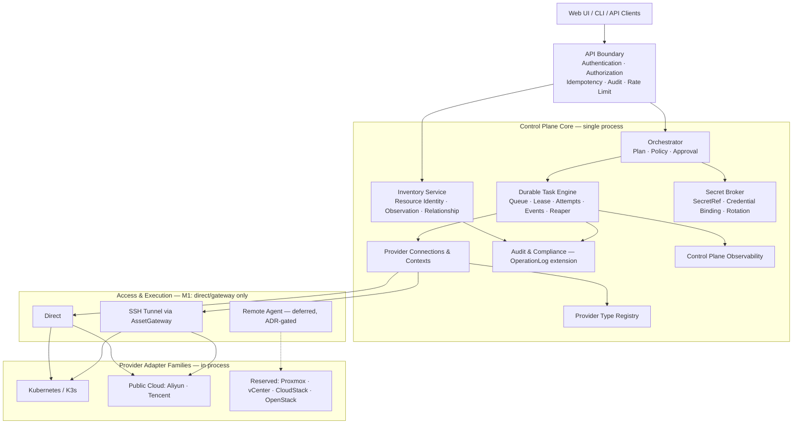
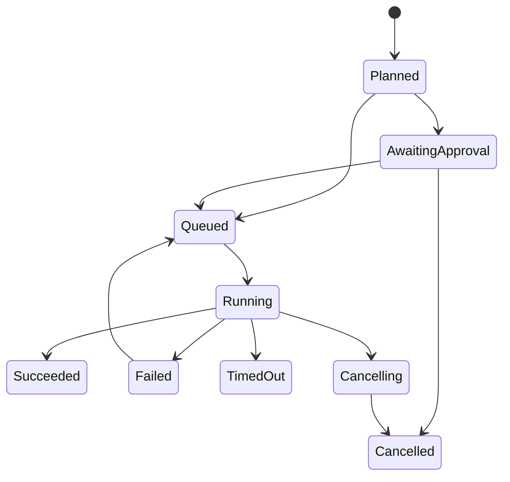

# Ops Admin Multi-Infrastructure Control Plane V2

> Tracking issue: #4
>
> Revision: r2. This revision incorporates the findings of a five-lens adversarial review of r1 (4 CRITICAL, 16 HIGH, 15 MEDIUM) plus a code-level cross-check of every claim. Appendix A maps each finding to the section that resolves it.
>
> Target platforms: Kubernetes (including K3s), public cloud (Aliyun, Tencent) as the second real provider family, and reserved support for Proxmox VE, VMware vCenter, Apache CloudStack, and OpenStack. r1 treated the reserved platforms as near-term phases; r2 corrects that ordering (Section 14, Section 20).

## 1. Decision

The existing V1 architecture document is not an implementation contract. It identified the right direction—provider adapters, common resources, capabilities, and asynchronous tasks—but did not sufficiently account for the security, authorization, durability, scheduling, connectivity, and migration constraints already present in the codebase.

r1 additionally promised scope the repository cannot justify: providers with zero lines of existing code were scheduled ahead of providers with existing code, 24 new tables were designed against a single-replica deployment, and no delivery milestone was independently shippable. r2 keeps the sound core and cuts the plan down to what one maintainer can deliver and stop at, safely.

The V2 decision is:

- Keep a **modular monolith** during the first transformation stages.
- Separate provider connection, provider context, and credential binding. Platform tenant binding is dropped: the system is **single-tenant by explicit decision**, not by omission (Section 7.6).
- Treat inventory observation and managed state as different concepts. A separate desired-state `ResourceIntent` model is deferred out of Milestone 1 (Section 7.7).
- Represent topology with resource relationships first; the full scope graph is deferred until more than one scope dimension actually exists (Section 7.7).
- Execute V2 infrastructure mutations through a **lightweight durable task engine**: three tables, database polling, and a stale-lease reaper. Lease fencing tokens, heartbeats, transactional outbox, and inbox are deferred until a second replica exists (Section 13).
- Make capability and operation definitions the source of truth for UI actions, authorization, risk, approval, auditing, retry, and redaction.
- Reuse the existing `OpsJob` approval semantics (`ApprovalStatus`/`Approver`) for provider-task approval instead of inventing a parallel approval model.
- Bound the transformation with a **domain disposition matrix** (Section 3): most of the existing product—DNS, certificates, database workbench, monitoring, CI/CD, notify—remains V1 and is explicitly not absorbed by V2 in Milestone 1.
- Deliver **Milestone 1 = Phase -1 through Phase 4** (security containment, foundation, Kubernetes/K3s vertical slice, Aliyun/Tencent read-only adapter) as an independently valuable, independently shippable unit. Everything after Milestone 1 is conditional (Section 5).
- Do not implement Proxmox, vCenter, CloudStack, or OpenStack anything until Milestone 1 is delivered and a real need for that platform exists.

### Explicit non-goals (r2)

Stating these prevents scope creep better than omitting them:

- **Multi-tenancy.** No `Tenant` entity, no tenant JWT claim surgery. The policy-input tenant field is the constant `default`. If multi-tenancy ever becomes a requirement it needs its own ADR touching identity, tokens, and every scoped table; it will not be retrofitted implicitly.
- **Absorbing working V1 mutation paths in Milestone 1.** DNS batch changes, SSL apply/renew, ACME, database backup, ops scripts/exec/schedule, and CI/CD pipelines keep their current execution paths. Section 3.3 defines which mutation families the task engine absorbs and when.
- **Remote connector agents in Milestone 1.** Reverse-stream console routing for NAT-resident providers has no design; it requires an ADR before any code (Section 12).
- **Message brokers, external secret backends, gRPC adapter runtimes.** Deferred with written re-entry triggers (Section 7.7, Section 13.6).

---

## 2. Adversarial review of the current code

This section is r1's diagnosis, kept and corrected. The adversarial review confirmed 9 of 10 findings as accurate—in several cases understated—and corrected three details (2.7, 2.8, and the measured secret inventory now in Section 4.1).

### 2.1 `AssetHost` conflates incompatible resource types

`backend/model/asset.go` stores SSH access, OS and capacity, public/private IPs, provider, region, instance ID, cloud account, gateway, and credential on one `AssetHost` record.

That model cannot safely distinguish:

- bare-metal server
- hypervisor node
- VMware ESXi host
- CloudStack host
- Proxmox node
- public-cloud virtual machine
- VMware virtual machine
- CloudStack instance
- Proxmox QEMU VM
- Proxmox LXC container
- Kubernetes node

**Decision:** Do not add more provider-specific fields to `AssetHost`. Introduce a shadow `InfraResource` inventory and migrate resource identities into explicit kinds.

### 2.2 `AssetCloudAccount` assumes one public-cloud credential shape

The current account model assumes `provider + access key + secret key + regions`. It cannot faithfully model:

- Proxmox API token and realm
- vCenter user/session and certificate trust
- CloudStack API key/secret plus domain/account/project
- OpenStack application credential plus domain/project
- Kubernetes kubeconfig, service account, or OIDC

The measured reality is worse than r1 stated: the same Aliyun/Tencent credentials are stored up to three times—`asset_cloud_account` (plaintext `SecretKey`), `integration_finops_account` (plaintext `SecretKey`, `BillingToken`), and `public_dns_account` (encrypted `AccessKeyCipher`/`SecretKeyCipher`)—with different encryption postures per copy.

**Decision:** Replace the conceptual role of `AssetCloudAccount` with separate provider connection, context, and credential-binding models, and collapse the triplicated cloud credentials into one `SecretRef` per credential. The legacy table remains only during migration.

### 2.3 Kubernetes-specific foreign keys leak into shared domains

Current shared models directly store Kubernetes-specific fields, including:

- `AssetService.K8sClusterID`
- `OpsApplicationEnvironmentBinding.K8sClusterID`
- `Namespace`
- `WorkloadType`
- `WorkloadName`

Extending this pattern would produce `ProxmoxClusterID`, `VCenterDatacenterID`, `CloudStackZoneID`, and similar provider-specific columns.

**Decision:** Application, service, environment, monitoring, database, and infrastructure associations must use typed bindings or relationships instead of provider-specific foreign keys. The existing `K8sClusterID` foreign keys convert at legacy cutover (Milestone 2), not earlier—converting them before the V2 resource identity is proven would just rename the coupling.

### 2.4 `K8sCluster` mixes connection, secret, runtime, inventory, and monitoring

The current cluster record includes endpoint, kubeconfig, gateway, monitoring datasource, version, node count, state, and sync timestamps.

**Decision:** Split responsibilities as follows:

```text
connection and endpoint  -> ProviderConnection
account/project/cluster  -> ProviderContext
secret material          -> SecretRef + CredentialBinding
cluster/node/workload    -> InfraResource + Observation
monitoring attachment    -> Typed Binding/Relationship (Milestone 2)
```

K3s is a Kubernetes distribution, not a duplicate platform model. It uses the Kubernetes adapter family with `distribution=k3s`.

### 2.5 The central `Service` is a God object

The current service owns authentication, SSH, gateway connections, Kubernetes clients and caches, operations scheduling, monitoring scheduling, backup scheduling, FinOps scheduling, notification dispatching, DNS, and certificate runtime state.

Adding multiple provider clients and workers to the same object would multiply shared mutable state and lifecycle coupling. Measured scope the r1 plan under-weighted: the DNS domain alone is an embedded DNS server (`internal/domain/dnsserver/server.go`, 434 lines) plus a provider layer, and the certificate domain is 1,336 lines of service code across five models. Any "decompose the God service" step that does not say what happens to these domains has no landing zone.

**Decision:** Split packages and dependencies into explicit modules while keeping one process initially. Section 3 states per domain whether it moves, stays, or is out of scope. The God-object decomposition itself is a Milestone 2 step with its own rollback plan (Section 19), not a cleanup to be waved at in a final phase.

```text
identity        access          secrets         provider
inventory       orchestration   tasks           policy
audit           operations      observability   finops
notification
```

### 2.6 Router and permissions are monolithic

`backend/router/router.go` registers 433 routes. Measured: **30** carry `RequirePermission`; the remaining sensitive surface is authentication-only. Many sensitive routes are protected only by authentication and not by resource-scoped authorization.

**Decision:**

- Each module exposes `RegisterRoutes(group, dependencies)`.
- Every route declares an operation definition.
- Infrastructure permissions are enforced server-side using provider context, resource scope, resource kind, environment, and operation.
- UI directives are not security boundaries.
- Phase -1 seeds role permissions so that enforcing permissions on sensitive routes locks out zero existing users (Section 4.7).

### 2.7 Provider selection is implemented with switches

DNS provider code is in fact already extracted to `internal/domain/provider/` (r1 incorrectly placed it inside the service package). What remains true: selection is by provider-name switch, and the Aliyun/Tencent cloud discovery code does live inside the service package (`backend/service/asset_cloud_aliyun.go` and peers). The defect is the selection regime, not the file layout of one domain.

**Decision:** Introduce a registry of versioned descriptors and factories. Core code may reference adapter interfaces and capability names but not provider product names.

### 2.8 Existing asynchronous execution is not durable

Current operations can create records and then execute work in process-local goroutines. A process crash can leave records in `running` state without recovery. The current deployment is a single instance (docker-compose, one API process); the multi-replica scheduler collision r1 warned about is hypothetical today but the crash-recovery gap is not—`running`-state orphans after a restart are a present defect, and the task engine must fix that case first (single writer, crash recovery) rather than the replica case (Section 13).

**Decision:**

- API handlers only create commands/tasks.
- Workers claim tasks by atomic compare-and-swap on status; a lease column guards crashes.
- Schedulers enqueue tasks but never perform business work directly.
- Task attempts and events are persisted.
- A stale-lease reaper reconciles after process loss.
- Fencing tokens and heartbeats are added when a second replica is introduced (Section 13.6).

### 2.9 Current audit logging is insufficient for an infrastructure control plane

Current auditing largely derives risk and descriptions from HTTP path strings and ignores GET requests. This misses mutating GET endpoints and cannot distinguish operations behind a generic provider-operation URL.

**Decision:** Operation definitions, not route strings, define:

- mutation status
- risk level
- required permission
- approval policy
- redaction schema
- idempotency policy
- retry policy
- timeout policy
- audit event type

The existing `OperationLog` remains the audit sink; it gains operation-definition-derived columns in Phase -1 rather than being replaced by a parallel audit system (Section 3, disposition "Extend").

### 2.10 Current secret handling is not acceptable for provider credentials

The measured inventory (Section 4.1): four domains store AES-GCM ciphertext in a legacy envelope with no version prefix (`base64(nonce||ciphertext)`), including a hard-coded development fallback key; seven models store credentials in plaintext across twelve fields; one read path falls back to treating the stored value as plaintext when decryption errors (`service/domain.go:102`). Repository-exposed example values must never be treated as production-safe.

**Decision:** Complete secret migration and key rotation before adding provider credentials (Section 4).

---

## 3. Scope boundary: domain and model disposition

r1 named three conversion targets (host, cloud account, Kubernetes) out of 89 persisted models and 9 view domains, then scheduled a "decompose the God service and router" phase that would touch all of them. That is not a plan; it is an unbounded liability. This section is the boundary. Every persisted model in `backend/model/` has exactly one disposition, and "remain" is a first-class answer.

### 3.1 Disposition vocabulary

```text
SUPERSEDE  V2 constructs replace this model's role; backfilled in shadow,
           authoritative only after cutover (Milestone 2).
EXTEND     Same table, new columns or semantics; no parallel replacement.
REMAIN     Stays V1 indefinitely in Milestone 1. Not "pending". Re-entry
           requires a milestone decision, not momentum.
OUT-OF-SCOPE  A product domain V2 does not govern even later (unless a
           future ADR says otherwise).
```

### 3.2 Domain × model disposition matrix

| # | Domain (model file) | Persisted models | Disposition | Milestone | Notes |
|---|---------------------|------------------|-------------|-----------|-------|
| 1 | Identity & access (admin, role, menu, dept, post, ldap_config, auth_session) | Admin, AdminRole, Role, RoleMenu, Menu, Dept, Post, LDAPConfig, AuthSession | REMAIN | — | Phase -1 seeds route permissions against these roles (§4.7). Menu stays DB-seeded; V2 views add seed rows (§17.4). |
| 2 | Audit (log.go) | LoginLog, OperationLog | EXTEND | -1 | OperationLog gains `mutating`, `risk_level`, `task_uid`, `policy_version` columns derived from operation definitions. No parallel audit table. |
| 3 | System config (system_config.go) | SystemConfig | REMAIN | — | `backend/config.yaml` untracked in Phase -1 (§4.6). |
| 4 | CMDB / assets (asset.go) | AssetHost | SUPERSEDE | M1 backfill / M2 cutover | Becomes `InfraResource` kinds. Read path cutover in Milestone 2 (§19). |
| 5 | | AssetCloudAccount | SUPERSEDE | M1 backfill / M2 cutover | Split into ProviderConnection + ProviderContext + CredentialBinding; triplicated credentials collapse into one SecretRef (§2.2). |
| 6 | | AssetCredential | SUPERSEDE | M1 | Fields encrypted in Phase -1 (§4.1); structurally replaced by SecretRef + CredentialBinding in Phase 1. |
| 7 | | AssetGateway | SUPERSEDE | M2 | Becomes AccessRoute, carrying the `network_zone` semantics that exist today (r1's AccessRoute dropped them). Authoritative until cutover. |
| 8 | | AssetHostGroup, AssetHostGroupRelation | REMAIN | — | Organizational grouping; orthogonal to infra identity. |
| 9 | | AssetService, AssetServiceWorkload | REMAIN | — | Business topology. Milestone 2 cross-links to InfraResource via InfraRelationship; table shape unchanged. |
| 10 | | AssetDatabase, AssetDatabaseMetricSnapshot, AssetChangeLog | OUT-OF-SCOPE | — | Database workbench domain (§3 row 12). AssetChangeLog remains its own audit trail. |
| 11 | Kubernetes (k8s.go) | K8sCluster | SUPERSEDE | M1 backfill / M2 cutover | Connection/secret split per §2.4. The ~40 payload/view structs in k8s.go are DTOs, not tables; they are rewritten as V2 API DTOs incrementally. |
| 12 | DNS (domain.go, left half) | PublicDNSAccount | EXTEND | -1 | Account row REMAINs; its `AccessKeyCipher`/`SecretKeyCipher` migrate to the v2 envelope (§4.1) and later to SecretRef at Milestone 2 cutover. |
| 13 | | PublicDomainSnapshot, InternalDNSSetting, InternalDNSZone, InternalDNSRecord, DNSAuditLog | REMAIN | — | Embedded DNS server (`internal/domain/dnsserver`) is untouched by V2. DNS batch mutations stay on current paths (§3.3). |
| 14 | Certificate (domain.go, right half) | SSLCertificate, SSLCertificateDomain, SSLCertificateVersion, SSLCertificateTask, SSLCertificateAuditLog | REMAIN | — | `PrivateKeyCipher` fields re-encrypted to v2 envelope in Phase -1. ACME flow untouched. Absorption is a Milestone 2+ decision, default no. |
| 15 | Database ops (database.go) | DatabaseSQLHistory, DatabaseTransferTask, DatabaseBackupPlan, DatabaseBackupRecord | OUT-OF-SCOPE | — | Backup jobs keep OpsJob scheduling. Not governed by the provider task engine. |
| 16 | AI integration (integration_ai.go) | IntegrationAIModel, -Conversation, -Message, -ToolConfig, -ToolAction, -KnowledgeDocument | OUT-OF-SCOPE | — | But: `POST /integration/ai/tool/execute` and `/confirm` enter the sensitive-route list in Phase -1 (permission + audit, §4.7); AI tool action authorization design is a separate future ADR. |
| 17 | FinOps (integration_finops.go) | IntegrationFinOpsAccount | EXTEND | -1 / M1 | Credentials (`SecretKey`, `BillingToken`) encrypted Phase -1; account unified with AssetCloudAccount identity at Phase 4 (same SecretRef); table remains for billing records. |
| 18 | | IntegrationFinOpsCostRecord, -Recommendation, -SyncLog | REMAIN | — | Sync continues via existing scheduler in M1; adapters migrate behind provider contracts read-only in Phase 4. |
| 19 | Monitor (monitor.go) | MonitorDatasource, MonitorLogShortcut, MonitorAlertRule, MonitorAlertTemplate, MonitorAlertTemplateGroup, MonitorAlertEvent, MonitorAlertEventTimeline, MonitorAlertAction, MonitorSilenceRule, MonitorAggregationRule, MonitorQueryHistory, MonitorDashboard, MonitorDashboardPanel | REMAIN | — | Datasource `Password`/`Token` encrypted Phase -1 (§4.1). Resource attachment via typed binding is a Milestone 2+ decision. |
| 20 | Ops execution (ops.go, scripts/exec/schedule) | OpsScript, OpsScriptVersion, OpsScriptVariable¹, OpsExecTask, OpsExecTargetResult, OpsScheduleTemplate, OpsScheduleTask, OpsScheduleTaskLog | REMAIN | — | Existing execution engine keeps its lanes. Schedule variable secrets re-encrypted Phase -1 (§4.1). Convergence with the provider task engine is a Milestone 2 decision (§3.3). ¹OpsScriptVariable is an embedded struct serialized into a text column, not a table — listed for completeness. |
| 21 | Ops jobs (ops.go) | OpsJobTemplate, OpsJob, OpsJobHistory, OpsJobHistoryStep | REMAIN | — | **Approval model reused**: ProviderTask adopts the `ApprovalStatus`/`Approver` semantics (§13.3) instead of new approval tables. |
| 22 | CI/CD (ops.go, app/pipeline) | OpsEnvironment, OpsApplication, OpsApplicationEnvironmentBinding, OpsAppBuildTask, OpsAppRelease, OpsAppArtifact, OpsImageRegistry, OpsAppPipeline, OpsAppPipelineRun, OpsAppPipelineRunStage | REMAIN | — | `OpsImageRegistry.Password` encrypted Phase -1. `OpsApplicationEnvironmentBinding.K8sClusterID` FK converts to a typed binding at Milestone 2 cutover together with §2.3. Deploy pipeline mutations are not absorbed by the task engine. |
| 23 | Notify (ops.go, notify) | NotifyTemplate, NotifyChannel, NotifyRule, NotifySendLog | REMAIN | — | Provider-task notifications wire into NotifyRule in Milestone 2 (§13.6 outbox deferral). |
| 24 | Integration nav (integration.go) | IntegrationNavigationGroup, IntegrationNavigation | REMAIN | — | |

**New tables created in Milestone 1 (13):**

```text
schema_migration           provider_connection        provider_context
provider_credential_binding  secret_ref                infra_resource
resource_observation        inventory_sync_run         infra_relationship
provider_task               task_attempt               task_event
```

(`idempotency` is enforced with a unique index on `provider_task(idempotency_key)` plus a completion check, not a separate table—see §13.4.)

**Tables r1 designed that r2 defers and does not create (11):**

```text
provider_tenant_binding    infra_scope                scope_relationship
resource_scope_membership   resource_intent            resource_lock
outbox_event                inbox_event                approval_request
approval_decision           connector_agent (+access_route at M2)
```

Each deferred table has a written re-entry trigger (§7.7, §13.6). No schema is created "for later".

### 3.3 Mutation-path absorption decision (r1 was self-contradictory)

r1 said "execute every infrastructure mutation through a durable task engine" and prohibited process-local mutations, while the product's actual mutation families—DNS batch changes, SSL apply/renew, ACME account operations, database backup, ops scripts/exec/schedule, CI/CD pipelines—were never scheduled for absorption. That contradiction is resolved by an explicit list, not by a slogan.

**Milestone 1 absorbs (ProviderTask):**

```text
Kubernetes workload restart (the Phase 3 proof)
future V2 provider operations as they are added (nothing else)
```

**Milestone 1 does not absorb (keeps current execution paths):**

```text
DNS record/zone mutations (internal + public provider batch writes)
SSL certificate apply / renew / upload
ACME account and order operations
Database transfer and backup jobs
Ops scripts, exec tasks, schedules, OpsJob orchestration
CI/CD build, release, pipeline runs
```

The §20 prohibition "process-local goroutines as durable infrastructure jobs" applies to **new V2 code**. Existing V1 lanes are exempt until their Milestone 2 convergence decision, at which point each family either migrates onto the task engine with a shadow-run of its own or is recorded as permanently exempt with a reason. The exemption list above is that record's seed.

### 3.4 What "done" means for scope

V2 governs provider connection/credential, inventory identity/observation, and V2-originated mutations. Everything else in the matrix says REMAIN or OUT-OF-SCOPE and remains true to its current behavior. A reviewer of any future PR should be able to reject a change on the grounds "this domain is REMAIN in §3.2 and this PR silently broadens V2 into it."

---

## 4. Security prerequisite: Phase -1

No new provider mutation is allowed until all Phase -1 controls are complete. Phase -1 gates are defined in §20 (exit criteria) and verified by the CI baseline (§4.10).

### 4.1 Secret field inventory (measured)

The complete list of secret-bearing persisted fields, with today's storage format. This table is the contract: anything not listed is not a secret; anything listed must satisfy §4.2–§4.5.

| # | Model (file) | Field(s) | Today | Class |
|---|--------------|----------|-------|-------|
| 1 | PublicDNSAccount (domain.go:9-10) | AccessKeyCipher, SecretKeyCipher | legacy envelope (`base64(nonce‖ct)`, no prefix) | E-legacy |
| 2 | SSLCertificate (domain.go:154) | PrivateKeyCipher | legacy envelope | E-legacy |
| 3 | SSLCertificateVersion (domain.go:191) | PrivateKeyCipher | legacy envelope | E-legacy |
| 4 | OpsScheduleTask secret variables (service/ops_schedule.go:156,176) | encrypted variable values | legacy envelope | E-legacy |
| 5 | AssetCredential (asset.go:65-67) | Password, PrivateKey, Passphrase | **plaintext** | P |
| 6 | AssetCloudAccount (asset.go:83) | AccessKeyID + SecretKey | **plaintext** | P |
| 7 | AssetGateway (asset.go:178) | Password | **plaintext** | P |
| 8 | K8sCluster (k8s.go:20) | KubeConfig | **plaintext** | P |
| 9 | IntegrationFinOpsAccount (integration_finops.go:11,15) | SecretKey, BillingToken | **plaintext** | P |
| 10 | MonitorDatasource (monitor.go:12-13) | Password, Token | **plaintext** | P |
| 11 | OpsImageRegistry (ops.go:486) | Password | **plaintext** | P |
| 12 | IntegrationAIModel (integration_ai.go:10) | APIKey | **plaintext** | P |
| 13 | LDAPConfig (ldap_config.go:14) | BindPassword | **plaintext** | P |
| 14 | NotifyChannel (ops.go:599) | Secret (and WebhookURL when it embeds a path token) | **plaintext** | P |

The r2 review cross-check caught rows 12–14 missing from the first cut of this table; the count is now 14 and G-1 (§4.10) gates over all of them.

Two defects beyond field classification:

- **Plaintext-tolerant decryption.** `service/domain.go:102` treats the stored value as plaintext when `DecryptSecret` errors (`err == nil` guard; measured: the fallback applies to the masked display-hint path, while the credential-material path at `service/domain.go:222` is already fail-closed). This fallback is deleted in Phase -1 **Step 4** (§4.4 — code removal rides the last step only, after verification); before Step 4 the dual-key reader tolerates the mixed window by design.
- **Hard-coded development fallback key.** `util/secret.go:41` seeds `"ops-admin-development-credential-key"` when no env key is set. After Phase -1, the fallback is permitted only when `GO_ENV == development` is explicit; production startup without a master key fails (§4.7 acceptance).

### 4.2 Envelope format v2

```text
v2:<key_id>:<base64url(nonce || ciphertext)>
```

- `<key_id>` names the master key in the key set, making rotation self-describing: the reader selects the key by ID, never by trial.
- Legacy values (no `v2:` prefix) remain readable during the migration window only.
- The key set comes from `OPS_SECRET_MASTER_KEYS` (ordered: `current_key_id:key_material[,old_key_id:key_material...]`). The writer always uses `current`.
- `key_material` is the **raw seed string**, not a digest: the runtime derives the AES key exactly as today (`sha256(seed)`, util/secret.go:44). The legacy key enters the set as `legacy:<the current credential-key value>` so Step-1 dual-key readers decrypt pre-migration data without format probing.

### 4.3 Triple detection rule

Migration and reads classify every inventory field by this ordered rule—format probing is always subordinate to the field registry, because a random plaintext string can base64-decode:

```text
classify(value, field):
  if field not in §4.1 inventory        -> NOT_SECRET (skip)
  if value is NULL or empty string      -> EMPTY       (skip; optional secrets are
                                                       legitimate, e.g. a certificate
                                                       version without a private key)
  if value starts with "v2:"            -> V2          (parse; decrypt with key_id)
  else if field class == E-legacy
       and value decodes as rawurl base64
       and GCM-open with a configured legacy key succeeds -> LEGACY
  else if field class == P              -> PLAINTEXT    (pre-migration)
  else                                  -> UNKNOWN      -> halt migration, quarantine report
```

Rules:

- UNKNOWN never falls through to plaintext. A value that claims neither format halts the run and is reported (model, row ID, field) for manual repair. This is the structural fix for the `err == nil` fallback: ambiguity is an incident, not a parsing strategy.
- Classification is a pure function of (registry, value); the Phase -1 migration tool and the runtime decrypt path share one implementation so they cannot disagree.
- A one-off inventory command emits the classification counts (per field: v2/legacy/plaintext/unknown) as the migration's pre-flight artifact.

### 4.4 Re-encrypt → verify → retire: the order contract

Key rotation touches four running domains (DNS accounts, SSL private keys, ACME, schedule secrets). Rotating the key under them without an order contract is a fail-closed outage. The contract, in mandatory order:

```text
Step 1  SHIP WRITER + READER (dual-key)
        - v2 envelope writer active for all new writes in E-class fields
        - reader accepts v2 (by key_id) and legacy (by legacy key) for E-class
        - P-class fields: writer starts emitting v2 into their columns
        - NO data is rewritten yet; NO key is removed
        - deploy; system runs normally on mixed data

Step 2  MIGRATE DATA (offline command, checkpointed)
        - for each §4.1 field, row by row, in §4.1 order:
            classify -> read (accepted path) -> write v2 under current key
            -> verify: decrypt-as-v2 equals in-memory plaintext (byte compare)
            -> mark checkpoint (table, pk) so the command is resumable
        - pre-migration column backup taken before first write (§4.5)
        - mid-run readers are unaffected (dual-key from step 1)

Step 3  VERIFY (gate, not a vibe)
        - re-run classifier over all rows: every §4.1 field is V2, zero
          LEGACY / PLAINTEXT / UNKNOWN
        - spot-decrypt random sample (>=10% or >=500 rows per table)
        - functional smoke: K8s kubeconfigs build a client config; DNS
          account credentials pass a provider list call; one SSL private
          key parses; one schedule secret round-trips
        - emit migration report artifact (counts above + sample results)

Step 4  RETIRE THE LEGACY PATH (code removal, separate PR)
        - delete the plaintext-tolerant fallback (domain.go:102 pattern)
        - delete the development fallback key from non-dev code paths
        - remove legacy key from the key set config
        - reader now: v2 only; anything else is a hard error + audit event

Step 5  CLOSE
        - destroy the column backup after the observation period (§4.5)
```

**Invariants:**

- Steps may not be reordered or merged into one PR. Each step is a deployable state in which the system is fully functional.
- K1 (the legacy/dev key) is never removed from the key set until Step 3's gate has passed on production data. Rotation cannot cause a domain outage because dual-key reading spans the entire window in which ciphertext is mixed.
- The `err == nil` plaintext fallback deletion happens only at Step 4—deleting it earlier would convert every not-yet-migrated P-class field into an outage.

### 4.5 Rollback (Phase -1 secret migration)

- **Writer/reader stage (Step 1):** roll back by deployment (revert PR); data written as v2 remains readable by the reverted build only if it still carries v2 support—so Step 1's PR keeps v2 read support in perpetuity. Rollback is safe.
- **Data migration (Step 2):** the command is checkpointed and idempotent; interruption leaves a mixed state that dual-key readers serve. Full rollback = restore the pre-migration column backup (`mysqldump` of affected columns, taken before first write, retained until Step 5).
- **Retirement (Step 4):** if a domain breaks after legacy-key removal (an unclassified consumer, an missed field), the recovery is to re-add the legacy key to the key set and revert the Step-4 PR; v2 data is unaffected. This is why Step 4 is a separate PR with an observation period (one release cycle) between Steps 3 and 4.
- **Backup destruction (Step 5):** only after one clean release cycle past Step 4.

### 4.6 Repository hygiene

`backend/config.yaml` is git-tracked today while `.gitignore:11` ignores only `deploy/config.yaml`. Any secret committed into `backend/config.yaml` defeats §4.10's secret-scanning gate against ourselves. Phase -1, first PR:

```text
git rm --cached backend/config.yaml
add backend/config.yaml to .gitignore
commit backend/config.example.yaml (placeholder values, no real endpoints)
document the copy-and-fill step in the README deployment section
```

The rotation in §4.4 assumes this lands first; a master key that can be silently re-committed is not a rotated key.

### 4.7 Authorization containment and the permission seed migration

Applying `RequirePermission` to the 400+ currently authentication-only routes without migrating role data locks out every existing user. Phase -1 does it in this order:

1. **Enumerate.** A route-inventory command (or test) emits all 433 routes with their current middleware. CI compares the generated list against the router; the acceptance criterion is an empty diff, not a hope (§24).
2. **Classify sensitive.** A route is *sensitive* if: method is non-GET, **or** the response can carry credential/secret material (asset credential reads, kubeconfig, AI tool execute/confirm, account/password management). The classified list is a committed artifact: `docs/security/sensitive-routes.txt`.
3. **Assign operation definitions** (permission string, mutating, risk, redaction) to each sensitive route. Permission strings reuse the existing `domain:resource:action` convention so existing role grants carry over; the V2 policy input object (§10) is derived from the operation definition plus the request, and the mapping rule is: one v1 permission string ↔ one operation definition name, recorded in the definition.
4. **Seed roles to preserve behavior.** Migration grants every existing role the permissions for the routes it can effectively reach today (today: all authenticated routes). Result: zero lockouts, enforced-by-default surface. Tightening per role is an operator task after Phase -1, not a migration behavior.
5. **Verify.** Replay test: for each role, for each sensitive route, request with a role token asserts the same allow/deny outcome as pre-migration (all allow). Any deny = migration bug.

### 4.8 Console and terminal containment

Main access tokens must not be placed in URLs.

```text
POST /api/v1/console-sessions        (Phase -1: v1 path shape kept)
  -> authenticate normal request
  -> authorize resource + protocol (operation definition)
  -> create one-time ticket, short expiry (<=30s), single use

WSS /api/v1/console/connect?ticket=...
  -> atomically consume ticket (UPDATE ... WHERE consumed_at IS NULL)
  -> bind to one resource and protocol
```

Deployment ordering (frontend and backend cannot flip atomically in this repo's release model):

```text
Release A (backend): ticket endpoint added; legacy query-token WS path still
        accepted; deprecation header emitted on legacy connects.
Release B (frontend): terminal/console views switch to ticket flow.
Release C (backend): legacy query-token path removed.
```

The same dual-acceptance window applies to mutating-GET removal: for one release the converted endpoints answer GET with `410 Gone` plus a header naming the replacement verb/path; scripts and bookmarks get a changelog entry in the same release. This is a single-operator tool; one release cycle is the honest window.

### 4.9 Mutation semantics

- Convert mutating GET endpoints per the §4.8 window.
- Require `Idempotency-Key` for V2 mutations (§13.4); v1 keeps current behavior.
- Persist actor, request ID, operation, risk, and task UID in `OperationLog` via the §3.2 row-2 extension.

### 4.10 CI baseline and its self-verification

Required checks (each is a CI workflow; today the repo has one guard workflow):

```text
backend-test        go test ./... -race, coverage gate on new V2 packages
frontend-build      production build + unit tests
migration-test      clean install + upgrade-from-fixture
secret-scan         gitleaks-style scan incl. the config.yaml history guard
route-coverage      generated route list vs sensitive-routes.txt vs router
arch-boundary       import rules (core must not import provider products)
l10n-guard          dictionary-key parity for touched dictionaries
```

Gate self-verification (a gate that cannot fail is decoration): `secret-scan` and `route-coverage` each include a canary job that plants a known fake secret / a known unlisted route in a scratch checkout step and asserts the gate reports it. A canary that does not fire fails CI.


---

## 5. Delivery plan: milestones, effort, and partial adoption

### 5.1 Operating reality

This is effectively a single-maintainer repository (419 commits, ~71% one author), 85K lines of code. r1 implied an engineering-year of work (24 new tables, lease/fencing/CAS task engine, mTLS agents, API V2, UI rework, six adapter families) with no estimate, no timeline, and no partial-adoption path—an all-or-nothing document. The worst outcome it invited was a frozen half-migrated tree: dual writes everywhere, neither system authoritative. This section makes every stopping point a valid one.

### 5.2 Milestones

```text
Milestone 1  (committed)   Phase -1  security containment
                           Phase 0   architecture contract (ADRs, registries)
                           Phase 1   operational foundation (13 tables, task engine)
                           Phase 2   Kubernetes/K3s read-only shadow + comparison
                           Phase 3   one Kubernetes mutation end to end
                           Phase 4   Aliyun/Tencent read-only adapter (Slice B)
                           -> deliver, declare, stabilize. Independently shippable.

Milestone 2  (conditional) triggered by explicit go-decision after M1 soak
                           Phase 5   Proxmox read-only + guarded operations
                           Phase 6   legacy cutover (host/cloud-account/k8s) +
                                     God service/router decomposition
                           deferred models re-entry (scope graph, outbox, agents)
                           as separate decisions, each with its own ADR

Milestone 3  (reserved)    Phase 7 vCenter · Phase 8 CloudStack · Phase 9 OpenStack
                           entered only when a concrete operational need exists
                           for that platform; each is a bounded vertical slice
                           reusing everything M1/M2 proved
```

**Milestone 1's declaration of done:** Slices A and B pass (§25), all Phase gates in §20 are green, and the release notes can honestly say: v1 hardened (secrets, permissions, tickets), Kubernetes inventory and one mutation class running on durable tasks, Aliyun/Tencent inventory unified behind provider contracts. Nothing in v1 broke.

### 5.3 Effort estimate (order of magnitude, single maintainer)

Rough by necessity; stated in focused-work weeks so calendar time can be derived (multiply by the reality of part-time availability):

| Phase | Size | Focused weeks | Dominant risk to the estimate |
|-------|------|---------------|-------------------------------|
| -1 | M | 2–3 | permission seed replay harness; secret migration on real data |
| 0 | S | 0.5–1 | writing ADRs that survive review |
| 1 | M | 2–3 | task engine + migration runner test depth |
| 2 | M | 1.5–2 | comparison tooling and field mapping (§15) |
| 3 | S/M | 1–1.5 | end-to-end polish: approval, idempotency, audit |
| 4 | M | 1.5–2 | normalizing existing Aliyun/Tencent payloads |
| **M1 total** | **XL** | **~9–13 weeks** | calendar 3–5 months part-time |
| 5 (Proxmox) | M | 2–3 | only if a real Proxmox endpoint exists to develop against |
| 6 (cutover) | L | 3–4 | rollback rehearsal; shadow-read duration |
| 7–9 (each) | M | 2–4 | per platform, after core is proven |

Estimates are planning anchors, not commitments. If a phase exceeds its band by ~2x, the response is to re-scope the phase against §3 (usually: another domain moves to REMAIN), not to silently extend.

### 5.4 Partial-adoption end states (every stop is safe)

- **After Phase -1 alone:** a security-hardened v1. Secrets in v2 envelopes with no plaintext fallback, permissions enforced with zero lockouts, one-time console tickets, tracked-config hygiene. Valid permanent stopping point; nothing else in the plan is required for this to be worth having.
- **After Phase 1:** foundation tables exist and are covered by tests but carry no production data yet. This is the weakest intermediate state, which is why Phases 1–2 are planned as one continuous block; Phase 1 does not ship alone.
- **After Milestone 1:** dual-run steady state. v1 remains authoritative for everything in §3 marked REMAIN; V2 serves K8s inventory + one mutation class and cloud inventory read-only, both through the new contracts. This is a valid *indefinite* state, not debt: the system is strictly better than pre-V2 at every moment.
- **Keeping the indefinite state true — backfill is a propagation rule, not a one-shot.** v1 CRUD for SUPERSEDE models stays live through all of M1 (CreateK8sCluster k8s.go:674 / Update :720 / Delete :770). Therefore: (a) the Phase 2 backfill command is **re-runnable and incremental** (checkpointed per row, keyed on updated-at; a second run reconciles only rows created or changed since the last run); (b) a v1 delete of an entity that has a V2 counterpart marks the V2 rows `stale_source=true` rather than silently keeping them; (c) until Phase 6 cutover, the V2 read side treats `stale_source` rows as absent for comparison purposes. Missing this rule would let a cluster added through v1 sit invisible to V2 forever — the exact "half-state" this section prohibits.
- **Invalid states, prohibited:** schema merged without behavior (dead tables), dual-write lanes with unclear authority (§19 names the authority during cutover), or a half-decomposed service (Phase 6 has its own rollback contract for exactly this reason).

### 5.5 Deferral triggers (what re-enables deferred scope)

```text
fencing tokens / heartbeat     a second API replica is actually deployed
outbox / inbox                 a second consumer of task events exists
scope graph (3 tables)         a provider with >=2 real scope dimensions lands
resource_intent                a declarative reconcile loop is genuinely wanted
connector agents               an ADR for reverse-stream console routing is
                               accepted AND a NAT-resident provider is in scope
vCenter/CloudStack/OpenStack   an operational need names the platform
multi-tenancy                  a second org actually uses the system (own ADR)
```

Each trigger is falsifiable: "we might need it someday" does not satisfy any of them.


---

## 6. Target architecture



Changes from r1: the outbox/inbox block is gone (deferred, §13.6); the third-party out-of-process adapter runtime is gone from the M1 picture (deferred with agents); the reserved platforms are drawn as reserved.

### Architectural rules

1. Core does not switch on provider product names.
2. Adapters never write control-plane tables directly.
3. Discovery and mutation are separate paths.
4. A discovered resource is not automatically managed.
5. Every V2 mutation creates a durable task even when the provider returns immediately.
6. Capabilities control UI, API validation, authorization, approval, retry, and polling.
7. Provider-native payloads are preserved as bounded, redacted observations; common queries use normalized fields.
8. Resource relationships are first-class and may cross providers. (The scope graph that would sit beside them is deferred, not cancelled.)
9. Built-in adapters run in process; a third-party adapter runtime exists only behind its ADR.
10. Single-tenant is a design invariant, not a TODO.

---

## 7. Core domain model

### 7.1 Provider type descriptor

Describes software support, not a configured endpoint. Descriptors are **code** (registered at compile time), not rows; no provider-type table exists in M1.

```go
type ProviderTypeDescriptor struct {
    Type            string
    AdapterVersion  string
    ProtocolVersion string
    ConfigSchema    func() ConfigSpec // typed builder, not a JSON blob
    ContextKinds    []string
    BuiltIn         bool
}
```

Registered types in Milestone 1, matching what exists:

```text
kubernetes        (K3s detected as distribution)
aliyun            (read-only inventory + finops reuse)
tencent           (read-only inventory + finops reuse)
```

Reserved (descriptors land with their milestone, not before):

```text
proxmox    vcenter    cloudstack    openstack
```

r1's example list (aws/azure/gcp) named providers with no code or stated need; it is corrected above.

### 7.2 Provider connection

Represents one reachable control endpoint and transport.

```go
type ProviderConnection struct {
    ID             uint
    UID            string
    ProviderType   string
    Name           string
    Endpoint       string
    GatewayID      *uint   // legacy AssetGateway FK until AccessRoute exists (M2)
    TLSProfile     JSONMap // CA/verify posture; no secret material
    ConfigJSON     JSONMap
    Status         string
    Version        string
    CapabilityHash string
    LastHealthAt   *time.Time
    CreatedAt      time.Time
    UpdatedAt      time.Time
}
```

Secret values are forbidden in `ConfigJSON`; `TLSProfile` carries trust material references (SecretRef UID), never PEM bodies.

### 7.3 Provider context

Represents a provider-native administrative scope behind a connection.

```go
type ProviderContext struct {
    ID           uint
    UID          string
    ConnectionID uint
    Kind         string // cluster, account, project, subscription
    ExternalID   string
    Name         string
    Status       string
    MetadataJSON JSONMap
    CreatedAt    time.Time
    UpdatedAt    time.Time
}
```

r1's `ParentID *uint` self-reference existed to build scope chains; with the scope graph deferred, context nesting is not modeled in M1. Kubernetes has exactly one context kind (cluster); Aliyun/Tencent have account (+region carried in `MetadataJSON`). If a provider needs real nesting, that is the scope-graph trigger (§5.5), not a quiet re-addition of `ParentID`.

### 7.4 Credential binding

A connection may use multiple credentials for different purposes.

```go
type ProviderCredentialBinding struct {
    ID                   uint
    ProviderConnectionID uint
    ProviderContextID    *uint
    Purpose              string // inventory, operations, billing, console, monitoring, backup
    SecretRefID          uint
    Status               string
    LastValidatedAt      *time.Time
}
```

The triplicated Aliyun/Tencent credential (§2.2) becomes: one `ProviderConnection` per provider account, one `SecretRef` per distinct credential, bindings with purposes `inventory` and `billing` (finops) pointing at the same `SecretRef` where the underlying cloud credential is shared.

### 7.5 Secret reference

```go
type SecretRef struct {
    ID         uint
    UID        string
    Backend    string // internal (M1); vault etc. deferred
    Path       string
    Version    string
    KeyID      string  // v2 envelope key id (§4.2)
    Ciphertext string  // internal backend only
    RotatedAt  *time.Time
    CreatedAt  time.Time
    UpdatedAt  time.Time
}
```

Secrets are never serialized through normal model JSON responses. The read path is the secret broker: callers receive purpose-scoped, short-lived material (§4.3's classifier guarantees a `SecretRef.Ciphertext` is always v2 after Step 4).

### 7.6 Tenancy: the single-tenant constant

Measured: zero `TenantID` fields across every current model. r1 nonetheless required `ProviderTask.TenantID`, "tenant context in token", and tenant-bearing audit—none of which had a defining Phase, entity, or ADR. r2 decides:

- There is no Tenant entity and no tenant claim in tokens.
- The policy input's `tenant` field is the constant `default`, set at the API boundary.
- Audit records carry no tenant column in M1.
- Multi-tenancy is an explicit non-goal (§1) whose re-entry is a second organization actually using the system.

### 7.7 Deferred model ledger (with re-entry triggers)

| Model (r1 name) | Why deferred | Re-entry trigger |
|---|---|---|
| `ProviderTenantBinding` | zero tenant fields exist anywhere (§7.6) | multi-tenancy ADR accepted |
| `ResourceIntent` | no desired-state reconciler exists; `InfraResource.ManagedState` covers M1 semantics | declarative reconcile loop genuinely wanted |
| `InfraScope`, `ScopeRelationship`, `ResourceScopeMembership` | today's measured scope surface is cluster/namespace—one dimension, one provider family | a provider lands with >=2 real scope dimensions |
| `OutboxEvent`, `InboxEvent` | zero event consumers exist; `task_event` in the same transaction covers audit needs | a second consumer of task events exists |
| `ResourceLock` | claim CAS + per-resource uniqueness (§13.4) suffices single-writer | multi-writer contention observed or 2nd replica |
| `ApprovalRequest`/`ApprovalDecision` | OpsJob approval semantics are reused on the task row (§13.3) | workflow-level multi-step approvals needed |
| `ConnectorAgent`, `AccessRoute` | no agent protocol design; gateways keep working via `ProviderConnection.GatewayID` | reverse-stream ADR accepted / M2 cutover |

Adding any of these tables without its trigger firing is a §22 violation.

---

## 8. Resource identity, observations, and managed state

### 8.1 Canonical resource

```go
type InfraResource struct {
    ID             uint
    UID            string
    ContextID      uint
    Kind           string
    Subtype        string
    ExternalID     string
    ExternalURN    string
    Name           string
    DisplayName    string
    LifecycleState string
    HealthState    string
    ManagedState   string // discovered, imported, managed, orphaned, tombstoned
    LabelsJSON     JSONMap
    FirstSeenAt    time.Time
    LastSeenAt     time.Time
    DeletedAt      *time.Time
}
```

Identity rule:

```text
UNIQUE(provider_context_id, kind, external_urn)
```

`ExternalURN` must include enough native scope to avoid collisions (namespace for workloads, cluster for nodes, region+instance-id for cloud VMs). Names and IP addresses are never primary identities.

### 8.2 Observation

```go
type ResourceObservation struct {
    ID                uint
    ResourceID        uint
    GenerationUID     string
    ObservationHash   string
    NormalizerVersion string
    NormalizedJSON    JSONMap
    RawJSON           JSONMap
    ObservedAt        time.Time
}
```

Rules:

- Raw payloads have size limits and schema redaction.
- Normalizer version changes can trigger re-normalization.
- Partial sync generations are not published.
- **Volume and retention (r2):** history rows are pruned by a scheduled job—normalized history retained 180 days, raw payloads 30 days, latest observation per resource kept unconditionally. `resource_observation` is indexed `(resource_id, observed_at DESC)`; if a single deployment exceeds ~1M rows, partition by month on `observed_at` before further tuning.
- **Dual-call accounting:** V2 sync calls the provider independently of v1's on-demand reads. There is no per-request double call, but sync intervals default to >=15 minutes per connection and are surfaced per provider rate-limit guidance. The `provider_rate_limit_total` metric (§18.2) makes the cost visible.

### 8.3 Managed state replaces ResourceIntent in M1

`discovered != managed` remains the law. In M1 the distinction lives on the resource row (`ManagedState`) plus the operation/task record; a separate desired-state document is deferred (§7.7). This is sufficient because M1 mutations are imperative operations (restart), not declarations.

### 8.4 Resource relationships

```go
type InfraRelationship struct {
    ID             uint
    FromResourceID uint
    ToResourceID   uint
    Type           string
    Source         string // discovery, user, policy, application_binding
    GenerationUID  string
    AttributesJSON JSONMap
    LastSeenAt     time.Time
}
```

r1 keyed relationships by entity UID strings; r2 uses FKs to `infra_resource` (cross-context is still supported—both ends are resources; cross-*provider* links are therefore unchanged in capability).

Examples:

```text
VM --runs_on--> Hypervisor Node
Pod --runs_on--> Kubernetes Node
PVC --backed_by--> Volume
Application --deployed_to--> Workload      (M2, application_binding source)
DNS Record --points_to--> Public IP        (M2, cross-domain)
```

### 8.5 Resource kind taxonomy

Initial common kinds:

```text
machine.baremetal
compute.hypervisor_node
compute.vm
compute.system_container
compute.image
compute.template
orchestration.cluster
orchestration.node
orchestration.namespace
orchestration.workload
orchestration.pod
network.segment
network.interface
network.ip
network.load_balancer
storage.pool
storage.volume
storage.snapshot
identity.account            (cloud account as a context-like resource)
```

Provider-native details remain subtypes or observation fields unless common policy and query use cases justify standardization.


---

## 9. Inventory synchronization

### 9.1 Sync generation

```go
type InventorySyncRun struct {
    ID           uint
    UID          string
    ConnectionID uint
    ContextID    uint
    Mode         string // full, incremental, targeted
    Status       string
    Cursor       string
    SeenCount    int
    CreatedCount int
    UpdatedCount int
    MissingCount int
    ErrorCode    string
    StartedAt    time.Time
    CommittedAt  *time.Time
    FinishedAt   *time.Time
}
```

### 9.2 Publication rules

- A full generation becomes authoritative only after all pages complete.
- An incomplete generation does not modify visibility of the previous complete generation.
- A resource is marked stale only after repeated absence in complete generations.
- A tombstone requires a provider delete event or a configurable stale threshold and grace period.
- Provider outage is not resource deletion.
- Every normalized record carries a generation and observation hash.
- Adapter cursors and rate-limit state are persisted.

### 9.3 Reconciliation outcomes

```text
created  updated  unchanged  stale_candidate  tombstoned
identity_conflict  normalization_failed  permission_denied
rate_limited  partial
```

---

## 10. Capability and operation contracts

### 10.1 Capability

```go
type Capability struct {
    Name           string
    Version        string
    ResourceKinds  []string
    ReadOnly       bool
    RequestSpec    func() any   // typed Go builders, not runtime JSON Schema
    ResultSpec     func() any
    Constraints    JSONMap
}
```

Initial names (M1):

```text
inventory.full
inventory.incremental
orchestration.kubernetes.read
orchestration.kubernetes.apply         (Phase 3: restart only)
compute.vm.read                        (Aliyun/Tencent)
cost.read                              (finops reuse behind contracts)
console.web_terminal                   (ticket flow, §4.8)
```

r1's list included vnc/spice console, system-container power, and volume/snapshot manage—capabilities of providers not in M1. They move to their owning phases.

### 10.2 Operation definition

```go
type OperationDefinition struct {
    Name               string
    Version            string
    ResourceKinds      []string
    RequiredCapability string
    RequiredPermission string   // v1-namespace string (§4.7 rule 3)
    Mutating           bool
    RiskLevel          string
    RequiresApproval   bool
    IdempotencyPolicy  string
    TimeoutSeconds     int
    RetryPolicy        RetryPolicy
    Redaction          func() any // typed redaction spec per result field
}
```

The operation definition is the source of truth for authorization, audit, UI, policy, and execution. **No new runtime dependencies in M1** (r1 implied a JSONSchema library): schemas are typed Go constructors validated at registration; a JSON-Schema tool is only evaluated when third-party adapters actually arrive.

### 10.3 Permission string mapping (v1 ↔ v2)

Rule: one operation definition ↔ one v1-convention permission string (`domain:resource:action`), declared in the definition. The V2 policy engine resolves the permission string first (role grants carry over unchanged), then applies the resource-scoped policy input on top:

```text
authorize = role_has_permission(def.RequiredPermission)
           AND policy_evaluate(policy_input)   // context/kind/environment/risk
```

This makes v1 role data the seed of v2 authorization instead of a migration project.

---

## 11. Adapter interfaces

Do not create one mandatory interface containing every feature.

```go
type BaseAdapter interface {
    Descriptor() ProviderTypeDescriptor
    Validate(ctx context.Context, connection ConnectionView) error
    Health(ctx context.Context, connection ConnectionView) HealthResult
    Close() error
}

type Discoverer interface {
    Discover(ctx context.Context, req DiscoverRequest) (DiscoverPage, error)
}

type OperationExecutor interface {
    Execute(ctx context.Context, req OperationRequest) (OperationHandle, error)
}

type TaskPoller interface {
    Poll(ctx context.Context, handle OperationHandle) (OperationStatus, error)
}

type TaskCanceller interface {
    Cancel(ctx context.Context, handle OperationHandle) error
}

type ConsoleBroker interface {   // M2+, with the agent ADR
    OpenConsole(ctx context.Context, req ConsoleRequest) (ConsoleSession, error)
}
```

`EventSubscriber` (r1) is removed until a provider with watch-style events is in scope and the inbox decision is reopened (§7.7).

Registry validation rules:

- A declared capability must map to an implemented interface.
- Operation definitions are immutable within a version.
- Adapters do not receive database handles.
- The secret broker issues only purpose-scoped, short-lived secret material.
- Adapter construction is test-double-friendly: every adapter is developed against the same contract harness (§23), so `fake` is a first-class adapter, not an afterthought.

### 11.1 Built-in adapters (M1)

Compiled into the Go binary, registered explicitly: kubernetes, aliyun, tencent, fake.

### 11.2 Third-party adapters (deferred)

r1's out-of-process gRPC/mTLS adapter runtime is deferred with the agent protocol (§12). Its re-entry trigger is a real third party wanting to ship an adapter; the design work is an ADR at that time, not before.

---

## 12. Access routes and remote agents

### 12.1 M1 access reality

M1 supports exactly two access routes, both already embodied in the codebase:

```text
direct      API server reaches provider endpoint directly
gateway     SSH hop via the existing AssetGateway model (ProviderConnection.GatewayID)
```

`AssetGateway` remains authoritative until Milestone 2, when it becomes `AccessRoute`—**carrying `network_zone`**, which r1's AccessRoute dropped.

### 12.2 Connector agents (deferred, ADR-gated)

r1 required "console session routing" through remote agents. For providers behind NAT that implies a reverse tunnel with bidirectional multiplexing; r1 contained zero design for it, and r2 will not schedule undesigned distributed-systems work. Before any agent code:

```text
ADR required: reverse-stream architecture
  - connection establishment direction and keepalive contract
  - stream multiplexing model (one control channel vs per-session dials)
  - mTLS enrollment, certificate rotation, revocation
  - task claim semantics over a lossy link
  - offline/cancellation policy
  - upgrade compatibility window
```

Re-entry trigger (§5.5): the ADR is accepted AND a NAT-resident provider (Proxmox/VCenter on a private network) is in scope. The web terminal for Kubernetes exec works through the API server in M1 (ticket flow, §4.8) and does not need an agent.

---

## 13. Durable task engine (lightweight)

r1 specified lease + fencing + CAS + heartbeat + four timeout classes + outbox + inbox + idempotency + lock tables: a multi-replica distributed system. The deployment is one replica. r2 right-sizes to the actual problem—**crash recovery for in-flight mutations**—and defers the replica machinery with written triggers (§13.6).

### 13.1 M1 shape: three tables, polling, reaper

```text
provider_task    the unit of work + lease column + approval columns
task_attempt     one row per execution attempt (worker, timing, error)
task_event       append-only state/event log, written transactionally
```

- Workers are in-process goroutines claiming via a poller (default interval 2s, configurable).
- No outbox/inbox/lock tables (§7.7).
- Approval lives on the task row, reusing OpsJob semantics (§13.3).

### 13.2 Claim and crash recovery

```sql
-- claim (single statement, atomic):
UPDATE provider_task
   SET status = 'running',
       lease_expires_at = NOW() + INTERVAL ? SECOND,
       attempt_count = attempt_count + 1
 WHERE id = ?
   AND status = 'queued'
   AND next_attempt_at <= NOW();
-- affected_rows == 1 ⇒ this worker owns the attempt; else back off
```

```text
stale-lease reaper (background loop):
  find status='running' AND lease_expires_at < NOW() - grace
  -> re-queue (status='queued', next_attempt_at=NOW) when attempts remain
  -> mark 'failed' with ErrorCode='lease_expired' when attempts exhausted
  -> append task_event('reaper_requeued')
```

A task stuck in `running` after a process crash is recovered within `lease + grace + poll interval`. This is the measurable fix for §2.8's orphaned-`running` defect. Task events and state changes commit in one transaction—this is what r1 wanted from the outbox, achieved without new infrastructure because there are no external consumers.

### 13.3 Approval: reuse the OpsJob model

`model/ops.go:538` already defines `ApprovalStatus` (default `not_required`) + `Approver`. `provider_task` adopts the same semantics and vocabulary:

```go
ApprovalStatus string // not_required | pending | approved | rejected
Approver       string
ApprovalAt     *time.Time
```

State machine: tasks whose operation definition sets `RequiresApproval` transition `planned -> awaiting_approval -> queued` on approval; rejection is terminal. No new approval tables (§7.7).

### 13.4 Concurrency and idempotency

- **Optimistic concurrency:** `provider_task.Version int` increments on every update; every write is `UPDATE ... WHERE id=? AND version=?` (this also satisfies r1's CAS requirement without a separate mechanism).
- **Idempotency:** unique index on `(idempotency_key)` where `idempotency_key IS NOT NULL`. A duplicate submit returns the existing task (200 with the current task body, header `Idempotency-Replayed: true`), never a second execution. No separate idempotency table.
- **Per-resource serialization:** generated column `active_flag = 1` while status is non-terminal, unique index `(resource_uid, active_flag)` where active—two non-terminal mutations of one resource cannot coexist. A conflicting submit fails fast with `ErrorCode='resource_busy'`.
- **Timeouts:** M1 keeps two classes—provider call timeout (per attempt) and task deadline (overall). Attempt-level retry deadlines merge into the provider-call budget; the four-class taxonomy from r1 returns with multi-replica concerns (§13.6).
- **Cancellation:** requested via status flag, acted on by the executing adapter's cancel path or at the next claim boundary; persisted either way.

### 13.5 State model



`Polling` collapses into `Running` in M1: poll cycles are attempts, visible in `task_attempt`/`task_event`, not a distinct state.

### 13.6 Deferred mechanics and their triggers

| Mechanism | Deferred because | Trigger |
|---|---|---|
| Fencing tokens | exactly one writer exists | second API replica deployed |
| Heartbeats | lease column + reaper cover single-process crashes | tasks exceed lease lifetime routinely (long polls) |
| Outbox relay | no external consumers | second consumer of task events |
| Inbox / event subscribe | no provider event streams in M1 | a watch-capable provider lands |
| Four timeout classes | two suffice for imperative ops | workflow-style tasks arrive |
| Notify integration | no consumer wiring yet | M2 decision (§3.2 row 23) |


---

## 14. Provider mapping

### 14.1 Kubernetes and K3s (Phase 2–3, Slice A)

Shared adapter family:

```text
ProviderContext: cluster
Resources: node, namespace, workload, pod, service, ingress, configmap,
           secret metadata, PV, PVC, storage class
```

- Detect distribution and version through API discovery.
- K3s node-service management would require host access; out of M1 scope (agent-gated, §12.2).
- Existing Kubernetes code is first wrapped behind a facade, then split into clients, normalizers, discoverers, and operations.

### 14.2 Public cloud: Aliyun and Tencent (Phase 4, Slice B) — the real second provider

r1 scheduled Proxmox—a provider with zero lines of code—ahead of the two providers that exist in the tree (`backend/service/asset_cloud_aliyun.go` + peers, 10 files each for aliyun/tencent including finops; all read-only plus cost/billing). r2 corrects the order:

```text
Scope: one ProviderConnection per cloud account
       one ProviderContext (kind=account; regions in MetadataJSON)
       SecretRef from the collapsed triplicated credential (§2.2, §7.4)
Resources (read-only): vm, disk, snapshot, eip/load balancer, vpc/switch,
                       security group, image
FinOps: existing cost record sync keeps its scheduler; the credential and
        account identity move behind ProviderConnection/SecretRef in Phase 4
```

Success condition (this is Slice B, §25): migrating the existing code behind the contracts requires **no core schema change and no provider-name branch in core**—proving the contract set on a provider that already exists, rather than on one that must be invented.

### 14.3 Proxmox VE (Milestone 2 reservation)

Entered only by the §5.2 go-decision, and only if a real Proxmox endpoint exists to develop against:

```text
Scope: cluster, node, QEMU VM, LXC, storage, network; UPID task polling
Note:  QEMU and LXC are different kinds; cluster quorum/HA health is not
       collapsed into VM health.
```

Minimum definition: read-only discovery first, then power/snapshot operations through existing task engine and approval. Estimate band in §5.3.

### 14.4–14.6 vCenter, CloudStack, OpenStack (Milestone 3 reservations)

Each is a bounded vertical slice reusing the proven core. Minimal entry definition for each:

```text
vCenter     scopes: datacenter, cluster, folder, resource_pool
            resources: ESXi host, VM, template, datastore, network
            identity: managed object references + server context
            tasks: vCenter task references

CloudStack  location scopes: zone, pod, cluster; tenancy: domain, account, project
            resources: host, instance, storage, volume, template, network, VPC
            tasks: async job ID
            rule: Host and Instance are never the same kind

OpenStack   scopes: region, domain, project, availability zone
            resources: Nova server, Neutron net/port/router, Cinder volume, Glance image
            tasks: service-specific handles + state polling
```

Entry precondition for any of them: a named operational need, an environment to test against, and Milestone 2 complete (the core must be proven on two real provider families first). r1's detailed per-phase PR assignments for these platforms are withdrawn.

---

## 15. Legacy/V2 comparison protocol (Phase 2)

r1's Phase 2 said "Compare legacy and V2 inventory results" and §17 said "Shadow-read: compare legacy responses with new projections." Both were unverifiable as written: the legacy side has **no stored inventory**—`GetK8sClusterDetail` is on-demand with a process cache (`cachedK8sClusterDetail`), and the DB stores only connection info. There was no capture method, no field mapping, no pass criterion, and no concurrency guarantee. This section is the protocol.

### 15.1 Snapshot capture

```text
tool: ops-admin compare-inventory --cluster <id> [--all]
      (subcommand; same binary, admin-only, never an HTTP route)

legacy side:
  calls the same service methods the v1 API handlers call
  (GetK8sClusterDetail et al.), with the process cache bypassed
  -> serialized to JSON with a capture timestamp per section

v2 side:
  the completed shadow InventorySyncRun's published generation,
  read back through the V2 projection queries (not internals)

pairing rule:
  v2 sync completes -> legacy capture runs immediately after
  -> the pair (legacy_ts, v2_ts) is recorded; |delta| must be <= 60s
     for counts/identity comparisons to be evaluated at all
  legacy_ts is the capture START instant (read set is frozen as the
  per-section capture begins); v2_ts is the sync completion instant.
  If a cluster's capture takes longer than 60s (measured by the tool,
  reported per run): re-pair once with sections captured serially and
  volatile sections dropped from that pair's evaluation (§15.3 classifies
  them anyway). A second over-run is a BLOCKER report, not an infinite
  re-capture loop.
```

Snapshots are stored as dated artifacts under the deployment's data directory and retained for the Phase 2 duration; they are not test fixtures.

### 15.2 Field mapping

The authoritative mapping table lives next to the normalizer (`inventory/k8s/mapping.md`, reviewed in the Phase 2 PR). Shape:

| Legacy path (K8sClusterDetail…) | V2 normalized | Rule |
|---|---|---|
| `nodes[].name` → `.metadata.uid` | `infra_resource.external_urn` = `urn:k8s:{cluster_uid}:node:{uid}` | identity by UID; name is display only |
| `nodes[].status` | `lifecycle_state` + `health_state` | state vocabulary table (one page) |
| node capacity/allocatable | `observation.normalized.node.*` | pass-through with unit normalization (Ki→GB) |
| workload replicas/ready | `observation.normalized.workload.replicas*` | pass-through |
| pod phase, restart counts | `observation.normalized.pod.*` | pass-through; restart counts are volatile (§15.3) |

Coverage rule: every field the legacy API response serializes appears in the table, mapped or explicitly marked `dropped(reason)`. Unmapped legacy fields are protocol bugs, not noise.

### 15.3 Mismatch classification

```text
BLOCKER     identity sets differ (a resource exists on one side only)
            count fields differ beyond tolerance with |ts delta| <= 60s
            non-volatile normalized field differs (kind, urn, image tag)

VOLATILE    allowed to differ unconditionally: timestamps, ages,
            restart counts, observed-at, ordering of arrays

DRIFT       count/status differences when |ts delta| > 60s
            -> not evaluated; triggers a paired re-capture

ABSENT      field exists on one side only and is marked dropped in
            the mapping table -> logged, not failed
```

Cluster mutations by third parties during the capture window land in DRIFT (the pair is re-captured); this is the honest answer to "no concurrency guarantee exists"—we do not pretend one, we bound and re-measure.

### 15.4 Pass and abort criteria

```text
pass (per cluster, per paired run):
  zero BLOCKER mismatches
  every VOLATILE difference logged (sampled into the report)
  >= 3 consecutive passing paired runs on different days

abort:
  any BLOCKER on 2 consecutive paired runs (after one DRIFT re-capture)
  -> stop shadow-sync development on that cluster, fix the normalizer
     or the mapping table, restart the 3-run clock
  identity_conflict outcomes in the sync run itself abort immediately
```

Phase 2's exit gate (§20) cites the stored comparison reports as evidence. The same protocol, with a mapping table per resource family, is the shadow-read definition for Milestone 2 cutover (§19).


---

## 16. API V2

### 16.1 Provider and inventory

```text
GET    /api/v2/infra/provider-types
GET    /api/v2/infra/provider-connections
POST   /api/v2/infra/provider-connections
GET    /api/v2/infra/provider-connections/{uid}
POST   /api/v2/infra/provider-connections/{uid}/validate
POST   /api/v2/infra/provider-connections/{uid}/sync
GET    /api/v2/infra/provider-contexts
GET    /api/v2/infra/resources
GET    /api/v2/infra/resources/{uid}
GET    /api/v2/infra/resources/{uid}/relationships
GET    /api/v2/infra/resources/{uid}/operations
```

### 16.2 Plan and execute

```text
POST   /api/v2/infra/resources/{uid}/operations/{name}/plan
POST   /api/v2/infra/resources/{uid}/operations/{name}/execute
GET    /api/v2/infra/tasks/{uid}
GET    /api/v2/infra/tasks/{uid}/events
POST   /api/v2/infra/tasks/{uid}/approve
POST   /api/v2/infra/tasks/{uid}/reject
POST   /api/v2/infra/tasks/{uid}/cancel
```

Required request context:

```text
Authorization
Idempotency-Key          (mutations; §13.4)
X-Request-ID
traceparent
tenant: constant "default" (server-set; no client header in M1)
```

### 16.3 Provider extensions

Only functionality that has no useful canonical representation may use:

```text
POST /api/v2/infra/provider-contexts/{uid}/extensions/{namespace}/{operation}
```

Requirements: registered capability, typed request/result, server-side authorization, approval and audit support, redaction, no direct database writes by the adapter, generic form allowed only for simple low-risk operations.

### 16.4 v1 compatibility window

`/api/v1` remains available **for the domains V2 does not govern** (§3) indefinitely, and for the migrated domains until their Milestone 2 cutover completes. The r1 phrasing "until equivalent V2 paths are verified" was circular for domains with no V2 path; §3 is the actual boundary. Phase -1's behavioral changes to v1 are enumerated in §4.8 (tickets, mutating GETs) and changelogged per release.

---

## 17. UI information architecture and the frontend plan

r1 required a UI it never scheduled: all 17 of its PRs were backend, while the web app has 132 routes, DB-seeded menus, and 21 i18n dictionaries. r2 fixes the accounting.

### 17.1 Information architecture (target)

```text
Infrastructure
├── Overview
├── Providers            (connections, contexts, credential bindings)
├── Inventory
│   ├── Kubernetes       (M1)
│   ├── Compute          (M1: cloud VMs)
│   └── …kinds arrive with providers
├── Tasks & Approvals
└── Audit                (later: links into existing OperationLog views)
```

Common resource detail shell: Summary · Relationships · Observations · Events · Configuration · Operations · Raw Provider Data (redacted, size-limited). Tabs and actions are generated from resource kind, capability, permission, policy, and observed state.

### 17.2 Route migration accounting (132 routes)

```text
M1: additive only — the Infrastructure section is net-new; zero of the
    existing 132 routes are rewritten or removed. Legacy K8s/cloud views
    keep reading v1 APIs.
M2 cutover: legacy K8s/cloud views are replaced by V2-backed views and
    their old routes 301 to the new ones; route-by-route checklist lives
    in the cutover runbook (§19).
Never: the domains marked REMAIN/OUT-OF-SCOPE in §3.
```

### 17.3 Menu and localization

Menus are DB-seeded (`store/` seeding) and localized via `web/src/utils/*-i18n.js` dictionaries (21 today). The V2 section adds:

- seed rows for the new menu group + items (one migration),
- keys in every existing dictionary locale on day one (the l10n-guard CI gate enforces parity, §4.10),
- the existing dictionary pattern as the i18n strategy of record for V2 — no new i18n framework.

### 17.4 Frontend PRs

See §21: each phase with UI surface ships its frontend in the same phase, not "later."

---

## 18. Audit and observability

### 18.1 Audit record

The audit sink is the extended `OperationLog` (§3.2 row 2). Minimum fields for V2 operations:

```text
actor_id, request_id, trace_id
provider_connection_uid, provider_context_uid, resource_uid
operation, operation_version
mutating, risk_level, policy_version
approval_status, approver
task_uid, provider_task_id
error_code, request_hash, result_hash, source_ip, created_at
```

Audit payloads are redacted using operation redaction specs. Raw provider errors are retained only in restricted diagnostics, never in user-facing messages.

### 18.2 Control-plane metrics — instrumented where

Format: Prometheus text exposition on an internal-only `/internal/metrics` endpoint. Labels and instrumentation points (r1 listed 15 names with none of this):

| Metric | Instrumented at | Labels | M1? |
|---|---|---|---|
| `provider_health` | health check loop, gauge 0/1 | connection | yes |
| `provider_api_latency_seconds` | adapter client wrapper, histogram | provider, op | yes |
| `provider_api_errors_total` | adapter client wrapper | provider, op, code | yes |
| `provider_rate_limit_total` | adapter client wrapper | provider | yes |
| `inventory_sync_duration_seconds` | sync runner | connection, mode | yes |
| `inventory_sync_resource_changes_total` | sync runner | connection | yes |
| `inventory_sync_partial_total` | sync runner | connection | yes |
| `provider_task_duration_seconds` | task engine (claim→terminal) | operation, status | yes |
| `provider_task_failures_total` | task engine | operation, code | yes |
| `provider_task_retries_total` | task engine | operation | yes |
| `worker_queue_depth` | poller, COUNT query | — | yes |
| `worker_lease_expired_total` | reaper | — | yes |
| `resource_stale_total` | staleness sweeper | kind | yes |
| `secret_access_total` | secret broker | purpose, backend | yes |
| `agent_heartbeat_age_seconds` | — | — | deferred (agents) |
| `outbox_backlog` | — | — | deferred (outbox) |

No alert thresholds are committed here; the deploy runbook owns them once baselines exist.

### 18.3 Required log fields

```text
request_id  trace_id
provider_connection_uid  provider_context_uid  resource_uid  task_uid
operation  attempt_no  error_code
```

### 18.4 AI tool path authorization (noted for the record)

`POST /integration/ai/tool/execute` and `/confirm` are in the Phase -1 sensitive-route list (§4.7): explicit permission + audit before anything else changes in that domain. A full authorization model for AI tool actions is a separate future ADR; V2's operation definitions are the natural home if/when that domain opts in (§3.2 row 16).

---

## 19. Migration strategy

The current startup sequence performs automatic migration and seeding from every application process. That is not acceptable for a control plane with a migration runner.

Use a versioned migration runner with a database lock and explicit phases (the `schema_migration` table is one of the 13 M1 tables).

```text
Expand      add new tables and non-breaking fields
Backfill    checkpointed conversion with dry-run and validation
Shadow-read compare via the §15 protocol (per resource family)
Cutover     switch selected reads and operations
Contract    stop legacy writes, then remove after an observation period
```

Migration requirements:

- schema version table; one migration runner at a time; database advisory lock
- checkpoint and resume; row-count and hash validation; identity-conflict report
- production dry-run; metrics and audit for migration actions

### 19.1 Cutover and God-object decomposition (Phase 6, Milestone 2)

r1 put irreversible schema removal and the God-service decomposition (2,833-line service, monolithic router) in a one-line-rollback final phase—the single riskiest moment of the whole program. r2 contracts it:

```text
preconditions (all must be green):
  - shadow comparisons passing per §15.4 for every family being cut over
  - backup taken AND a restore rehearsal executed on a scratch database
    (a backup nobody has restored is a hope, not a rollback)
  - the dual-write authority rule is published (below)

authority during dual-run:
  - V2 is authoritative for: K8s/cloud inventory reads it serves,
    V2-originated mutations
  - V1 remains authoritative for: everything in §3 REMAIN, and for the
    legacy write paths still in service
  - conflicts resolve toward V1; shadow discrepancies are §15 BLOCKERs

decomposition order (each step is a separately revertible PR):
  1. route registration splits per module (router only; behavior-neutral)
  2. provider/k8s/cloud client state moves out of Service into adapters
     (behavior-neutral, covered by §15 comparisons re-run after each step)
  3. legacy read paths for migrated families flip to V2 projections
  4. legacy write paths stop (per §3.3 families, by decision)
  5. legacy columns/tables drop only after one release-cycle observation
     with zero legacy-path traffic (log-verified)

observation period: one release cycle per family, minimum

rollback:
  - steps 1-2: revert the PR (behavior-neutral by construction)
  - step 3: flip reads back (config flag per family, retained one cycle)
  - step 4: re-enable legacy writes (paths retained but dark for one cycle)
  - step 5: restore from the rehearsed backup if data loss is discovered
  - shadow-read discontinuation criterion: two consecutive weekly
    comparisons with zero BLOCKERs, or the flag-based read flip is
    considered unproven and stays dual
```


---

## 20. Implementation phases and gates

Every phase has explicit exit criteria. A phase whose gate cites an artifact (report, list, diff) means the artifact is stored and referenced, not summarized from memory. r1's Phase -1 gate was "all controls are complete"—circular; the gates below are checkable.

### Phase -1: Security and execution containment

Work:
- config.yaml untrack (§4.6, first PR)
- envelope v2 + triple detection + re-encryption contract executed (§4.2–§4.5)
- sensitive-route permission seeding + replay verification (§4.7)
- one-time console tickets with the A/B/C release sequence (§4.8)
- mutating-GET conversion window (§4.8)
- CI baseline workflows + gate canaries (§4.10)

Exit gate:
```text
G-1  §4.1 classifier report: zero PLAINTEXT, zero LEGACY, zero UNKNOWN
     across all 14 inventory rows (post Step-3 artifact)
G-2  key-rotation report: migrated == verified == total, per field
G-3  route-coverage CI: generated router list == committed list;
     100% of sensitive-routes.txt entries carry RequirePermission
G-4  permission replay test: every role x sensitive route allow-outcome
     identical to pre-migration baseline
G-5  negative tests green: ticket reuse rejected; legacy query-token path
     removed in release C; no master key in prod fails startup
G-6  all seven CI workflows green, canaries included
```

### Phase 0: V2 architecture contract

Work: ADRs (modular monolith; provider model; single-tenant decision; task-engine scope; secret envelope v2; comparison protocol), provider mapping matrix, resource-kind + capability registries as code, arch-boundary CI rules.

Exit gate: ADR set merged; `arch-boundary` workflow rejects a planted core→provider-product import (canary); registries compile and the fake adapter registers.

### Phase 1: Operational foundation

Work: versioned migration runner; the 13 M1 tables; secret broker reading SecretRef; task engine (poller, reaper, approval columns, idempotency) with the fake adapter; contract test harness.

Exit gate: crash-recovery test (kill worker mid-task, reaper re-queues) green under `-race`; duplicate idempotency key returns the same task; per-resource uniqueness blocks a second active mutation; fake adapter runs a full plan→approve→execute→audit cycle in tests.

### Phase 2: Kubernetes/K3s read-only vertical slice

Work: backfill cluster connections into connection/context/SecretRef (re-runnable and incremental, with stale-source marking — the propagation rule in §5.4); read-only discovery into resource/observation/relationship; distribution detection; comparison tooling per §15.

Exit gate: §15.4 pass (3 consecutive clean paired runs); identity-conflict count zero; sync of the largest cluster completes within rate budget (`provider_rate_limit_total` flat); UI shows K8s inventory from V2 (additive routes).

### Phase 3: One Kubernetes mutation end to end (Slice A)

Work: workload restart through plan → permission → policy → approval (optional) → idempotency → resource revision → execute/poll → result audit → observation refresh.

Exit gate: Slice A trace (§25) green in CI against kind; crash-injected run recovers and does not double-restart (restart count asserted from the cluster, not from logs); audit record complete per §18.1.

### Phase 4: Aliyun/Tencent read-only adapter (Slice B)

Work: existing aliyun/tencent inventory code behind Discoverer contracts; credential triplication collapsed into one SecretRef; cloud resources as InfraResource kinds; FinOps sync keeps its scheduler on the unified credential.

Exit gate: Slice B (§25): discovery of a real account with no core schema change and no provider-name branch in core (arch-boundary CI proves the negative); comparison vs legacy cloud views passes §15 protocol per mapped family; UI compute inventory reads V2.

### — Milestone 1 declaration —

§5.2's definition of done; tag, changelog, soak period before any M2 decision.

### Phase 5 (M2, conditional): Proxmox read-only + guarded operations

Minimum scope: read-only discovery (cluster/node/QEMU/LXC/storage/network), then power/snapshot ops through the existing engine; UPID polling as attempts. Precondition: go-decision + real endpoint. Gate: Slice B criteria re-proven on Proxmox.

### Phase 6 (M2, conditional): Legacy cutover and decomposition

Scope and rollback per §19.1. Gate: per-family §15.4 pass; restore rehearsal completed; observation period elapsed with zero legacy-path traffic before drops.

### Phase 7–9 (M3, reserved): vCenter · CloudStack · OpenStack

Entry per §14.4–14.6 preconditions. Each phase's first deliverable is a scope note bound to §5.3's estimate band; if the note cannot be written, the phase is not entered.

---

## 21. PR decomposition

Coverage rule: every phase's backend and frontend work ships within that phase (r1's list was 100% backend and stopped at Phase 7). Ordering is dependency-ordered; sizes are deliberate—no PR mixes legacy model replacement with a provider implementation.

```text
Phase -1
 1. chore(security): untrack backend/config.yaml, add example + docs
 2. feat(secrets): v2 envelope, key set, classifier (shared impl)
 3. feat(secrets): dual-key reader/writer across §4.1 fields
 4. chore(secrets): checkpointed re-encryption command + verify report
 5. refactor(secrets): retire legacy path, delete plaintext fallback
 6. feat(auth): sensitive-route inventory + operation definitions + seeds
 7. feat(auth): permission replay test harness
 8. feat(console): one-time ticket flow (backend A)
 9. feat(web): terminal views switch to tickets (frontend B)
10. refactor(console): remove legacy query-token path (backend C)
11. build: seven CI workflows + gate canaries

Phase 0
12. docs: ADR set (monolith, provider model, tenant, engine scope, envelope,
    comparison protocol)
13. feat(infra): provider/capability/operation registries as code + fake adapter
14. build: arch-boundary rules + canary

Phase 1
15. feat(store): versioned migration runner + schema_migration
16. feat(infra): connection/context/credential/secretref models + broker
17. feat(tasks): provider_task/attempt/event + poller + reaper
18. feat(tasks): approval columns + idempotency + resource uniqueness
19. test(tasks): crash/collision/idempotency suites (-race)

Phase 2
20. feat(inventory): k8s discoverer + normalizer + mapping.md
21. feat(inventory): shadow sync + reconciliation outcomes
22. feat(tools): compare-inventory command + report artifacts
23. feat(web): Infrastructure section shell + provider list (additive)

Phase 3
24. feat(tasks): restart operation end-to-end + audit extension
25. feat(web): task detail/approval UI + resource operations panel
26. test(e2e): Slice A Playwright trace

Phase 4
27. refactor(cloud): aliyun inventory behind Discoverer contract
28. refactor(cloud): tencent inventory behind Discoverer contract
29. feat(cloud): credential collapse to shared SecretRef + finops rewire
30. feat(web): compute inventory from V2 + Slice B e2e

Milestone 2+ (scoped at entry; shape for reference)
31. feat(proxmox): read-only adapter …    (Phase 5)
32. refactor(cutover): router split per module
33. refactor(cutover): service decomposition steps 2-5 …  (Phase 6)
34. feat(web): legacy route flips + 301s
```

Progress tracking: the phase→PR map above is mirrored as the checklist in tracking issue #4; a phase is complete when its PRs are merged and its §20 gate artifacts are linked. Partial completion is judged against the gate, never the PR count. Resume protocol: read the issue checklist + latest gate artifact; do not infer state from the tree.

---

## 22. Prohibited shortcuts (r1's list, kept; gate mapping added)

| # | Shortcut | Enforced by |
|---|----------|-------------|
| 1 | Provider-specific foreign keys in shared domain tables | code review + §3 boundary |
| 2 | A new static menu/controller/service/table set for every provider | §3 + UI generated from capabilities |
| 3 | A universal provider interface with dozens of mandatory methods | §11 interface review |
| 4 | An unvalidated JSON-only CMDB | §8.1 identity rule + mapping tables |
| 5 | Names or IP addresses as global identity | §8.1; comparison BLOCKER on identity |
| 6 | Treating provider request acceptance as task success | Phase 3 e2e asserts cluster state |
| 7 | Process-local goroutines as durable infrastructure jobs | applies to new V2 code (§3.3); engine tests |
| 8 | Main JWT tokens in WebSocket or console URLs | G-5 negative test |
| 9 | Retry paths that force risk confirmation to true | retry policy from operation definition |
| 10 | Third-party adapters inside the trusted API process | deferred out-of-process runtime ADR |
| 11 | Automatic destructive deletion after one failed inventory sync | §9.2 publication rules + tests |
| 12 | Automatic migration from every API replica | migration runner + advisory lock |
| 13 | Equating provider project/account with platform tenant | §7.6 single-tenant constant |
| 14 | Treating K3s as a separate duplicate Kubernetes model | §14.1 distribution detection |
| 15 | Treating CloudStack Host and VM Instance as one Host type | §14.4–14.6 |
| 16 | (r2) Creating any §7.7 deferred table without its trigger fired | §5.5 ledger review |
| 17 | (r2) Scheduling code for a provider with no environment to test against | §14 entry preconditions |
| 18 | (r2) A PR that broadens V2 into a §3 REMAIN domain | reviewer checklist |

Items 16–18 are r2 additions. A prohibition without an enforcing mechanism is a wish; the "Enforced by" column is checked during Phase 0 ADR review and cited in review templates.

---

## 23. Test strategy

r1 mentioned "fake adapter and contract test harness" once and never defined a strategy; measured reality is one CI workflow (guard), k8s domain test coverage near zero for 5,062 lines of service code. This section is the contract.

### 23.1 Tiers

```text
unit        pure functions: classifier (§4.3), normalizers, URN builders,
            state transitions, permission mapping
engine      task engine against a real MySQL (testcontainer):
            claim races (-race + parallel claims), reaper recovery,
            idempotency replay, resource-uniqueness rejection,
            crash injection (SIGKILL worker between claim and commit)
contract    every adapter (fake, kubernetes, aliyun, tencent) runs the
            same harness: discovery paging, error taxonomy, rate-limit
            signaling, redaction of raw payloads
e2e         Playwright: Slice A user flow (view → restart → approval →
            task result) and Slice B (add provider → inventory renders)
migration   clean install + upgrade-from-fixture with row counts and
            §4.1 field classification asserted post-migration
```

### 23.2 Real-provider testing

```text
Kubernetes   kind cluster in CI, seeded fixture (namespaces, workloads of
             each kind, pods in phases); K3s assertion via a k3d node job
             on a weekly cadence, not per-PR
Aliyun/Tencent  recorded fixtures (captured responses, redacted) drive
             contract tests per-PR; optional live smoke behind env vars,
             run manually before Phase 4 gate, never required in CI
Proxmox+     no tests until the environment exists (§14.3 precondition)
```

No live cloud credentials in CI, ever.

### 23.3 Coverage targets

```text
new V2 packages (provider, inventory, tasks, secrets, policy): >=80%
    statement coverage, measured per package on changed code
legacy packages: no target; regression = existing tests stay green
engine + secrets packages: additionally require the crash/collision
    scenario list green under -race (coverage alone insufficient)
```

### 23.4 Negative tests (the list r1 never had)

```text
N1  ticket reuse: second WS connect with a consumed ticket -> 401 + audit
N2  ticket expiry: connect after TTL -> 401
N3  forbidden operation: role without permission -> 403, policy denial audited
N4  production startup without master key -> non-zero exit
N5  undecryptable E-class value -> hard error; no plaintext passthrough
N6  duplicate Idempotency-Key -> same task returned, single execution
    (execution count asserted at the provider double, not the log)
N7  stale lease after simulated crash -> reaper re-queues; no lost task
N8  partial sync generation -> previous generation remains authoritative
N9  provider outage mid-sync -> no tombstones created
N10 mutating GET after window -> 410 with replacement header
N11 resource busy: second mutation on same resource -> fast fail
N12 comparison BLOCKER identity mismatch -> Phase 2 gate refuses to pass
```

These run in CI; a green suite without N1–N12 is not green.

---

## 24. Acceptance criteria

r1 declared ~16 of 33 criteria unverifiable as written ("normal APIs", "sensitive endpoints" undefined). r2 grounds every set and names its evidence.

### Set definitions (used below)

```text
SENSITIVE   = the committed, CI-reconciled list docs/security/sensitive-routes.txt
NORMAL_APIS = all /api/v1 + /api/v2 JSON endpoints minus SENSITIVE
V2_PACKAGES = backend packages created by this plan (registry-pinned list
              in the coverage workflow config)
```

### Architecture

- A1 Adding a provider does not require a core schema change — proven by Slice B on a provider that existed before V2.
- A2 Provider product names absent from orchestration decision branches — `arch-boundary` CI (negative canary merged).
- A3 Physical machines, hypervisor hosts, VMs, system containers, and Kubernetes nodes are distinct kinds — registry test enumerates distinct kind constants.
- A4 Resource relationships queryable across providers — integration test joins two providers' resources via one relationship row.
- A5 Discovery observations and managed state are separate — model test: an observation exists for a resource with `ManagedState=discovered` and no capability is implied.

### Security

- S1 No §4.1 secret field is serializable in any NORMAL_APIS response — DTO scanner over response types, run in CI.
- S2 Production startup fails without a master key — N4.
- S3 100% of SENSITIVE routes enforce RequirePermission — route-coverage CI (empty diff vs committed list).
- S4 Console access uses one-time tickets; legacy query-token path deleted — N1, N2, G-5.
- S5 Every V2 mutation is audited with operation, resource, policy, approval, and task identity — audit completeness test per Phase 3.
- S6 Key rotation completion — G-2 report artifact: per-field migrated == verified == total.

### Durability

- D1 Every V2 mutation is a durable task — engine is the only write path (code review + arch-boundary).
- D2 Crash recovery — N7 under `-race`.
- D3 Idempotent duplicates — N6 with provider-side execution count.
- D4 Stale workers cannot commit — attempt CAS on `provider_task.Version`; engine test.
- D5 State/event consistency — task_event rows commit in the same transaction (engine test asserts absence of orphan events after injected failure).

### Inventory

- I1 Partial sync never replaces the last complete generation — N8.
- I2 Provider failure does not mass-delete — N9.
- I3 Identity conflicts reported, not merged — reconciliation outcome test.
- I4 Raw snapshots size-limited, redacted, retained per §8.2 — contract test.

### Compatibility

- C1 Existing K8s functions keep working during shadow migration — v1 route regression suite stays green through Phase 2–4.
- C2 `/api/v1` availability boundary follows §3 (not "until verified" circularity) — §16.4 + cutover runbook.
- C3 K8s and K3s share the adapter family — distribution detection test.
- C4 Slice B adds the second provider without common-page rewrites — e2e on shared inventory UI.

### Quality

- Q1 Contract suite passes for fake, kubernetes, aliyun, tencent — CI matrix.
- Q2 Rate limiting, timeout, partial failure, duplicate event, crash scenarios covered — §23.1 engine/contract lists.
- Q3 Clean-install and upgrade migration tests pass — CI.
- Q4 `go test ./...` passes; frontend production build passes — CI.
- Q5 All seven gates + canaries green — CI.
- Q6 V2_PACKAGES statement coverage >= 80% — coverage workflow.

---

## 25. First proof of architecture

The architecture is considered viable only after both slices succeed:

### Slice A: Kubernetes/K3s (Phases 2–3)

```text
existing cluster
  -> ProviderConnection and ProviderContext
  -> complete shadow inventory generation (+ §15 comparisons passing)
  -> capability-based resource view
  -> workload restart plan
  -> policy and optional approval
  -> durable ProviderTask (crash-injected in CI)
  -> adapter execution
  -> audit and refreshed observation
```

### Slice B: Aliyun/Tencent public cloud (Phase 4)

```text
existing cloud account (real credentials, collapsed SecretRef)
  -> read-only discovery through the same contracts as Kubernetes
  -> common inventory UI renders compute kinds
  -> no shared schema change (diff-proven)
  -> no provider-name branch in core orchestration (arch-boundary CI)
```

If Slice B requires changing the core schema or replacing the common UI, the provider contract has failed and must be corrected before any reserved platform work begins. r1 ran this test on Proxmox, a provider that did not exist; r2 runs it on one that does—which is the only version of the test that counts.

---

## Appendix A: Adversarial review → resolution map

| Finding | Severity | Resolved in |
|---------|----------|-------------|
| CR-1 secret envelope detection absent | CRITICAL | §4.1 inventory, §4.2 envelope, §4.3 detection, §4.4 order contract, §4.5 rollback |
| CR-2 V2 adoption boundary undefined | CRITICAL | §3 matrix (24 rows covering every persisted model), §3.3 absorption list, §16.4 |
| CR-3 feasibility undefined | CRITICAL | §5 milestones, §5.3 effort, §5.4 end states, §5.5 triggers |
| CR-4 Phase 2 comparison undefined | CRITICAL | §15 protocol, §20 Phase 2 gate |
| H-1 entity/field migration mapping | HIGH | §7.2–7.5 (GatewayID, credential collapse in §2.2/§7.4), §19 cutover steps, §14.2 |
| H-2 mutation absorption contradiction | HIGH | §3.3 explicit list + exemption record |
| H-3 key rotation order | HIGH | §4.4 steps + invariants |
| H-4 config.yaml tracked | HIGH | §4.6 |
| H-5 Phase 9 one-line rollback | HIGH | §19.1 full contract |
| H-6 permission lockout | HIGH | §4.7 seed migration + replay |
| H-7 WS deploy coordination | HIGH | §4.8 A/B/C releases |
| H-8 v1 compat window | HIGH | §4.8, §16.4 |
| H-9 tenant decision absent | HIGH | §7.6, §1 non-goals, §13 task model (no TenantID) |
| H-10 agent reverse stream undesigned | HIGH | §12.2 ADR gate, deferred from M1 |
| H-11 frontend unscheduled | HIGH | §17 plan, §21 frontend PRs |
| H-12 unverifiable acceptance | HIGH | §24 set definitions + §23.4 negative tests |
| H-13 no test strategy | HIGH | §23 |
| H-14 phantom providers prioritized | HIGH | §14 reorder (aliyun/tencent first), §5.2, §22 item 17 |
| H-15 speculative models | HIGH | §7.7 ledger, §3.2 deferred-tables list |
| H-16 task engine overkill | HIGH | §13 lightweight design, §13.3 approval reuse, §13.6 deferrals |
| M-1 i18n strategy | MEDIUM | §17.3 |
| M-2 AI tool authorization | MEDIUM | §18.4, §4.7 sensitive list |
| M-3 CAS vs missing version field | MEDIUM | §13.4 `Version` column |
| M-4 ResourceLock semantics / relay params | MEDIUM | §13.4 uniqueness design; relay deferred §13.6 |
| M-5 scope graph cycle/CTE rules | MEDIUM | scope graph deferred (§7.7); MySQL 8.0 requirement moves with it |
| M-6 observation volume | MEDIUM | §8.2 retention/partition/dual-call |
| M-7 metrics instrumentation points | MEDIUM | §18.2 table |
| M-8 progress tracking | MEDIUM | §21 tracking protocol |
| M-9 phase gates | MEDIUM | §20 all phases gated |
| M-10 gate self-verification | MEDIUM | §4.10 canaries |
| M-11 prohibition→gate mapping | MEDIUM | §22 enforcing column |
| M-12 emergency key destroy / tenant key isolation | MEDIUM | single-tenant (§7.6) moots tenant isolation; emergency runbook noted as deploy-runbook scope in §18.2 |
| M-13 new dependencies unspecified | MEDIUM | §10.2 none in M1 |
| M-14 v1 permission string mapping | MEDIUM | §10.3 |
| M-15 example providers ≠ real ones | MEDIUM | §7.1 registered list |
| L §2.7 inaccuracy | LOW | §2.7 corrected |
| L NetworkZone dropped | LOW | §12.1 |
| L replicas hypothetical | LOW | §2.8 corrected |

## Appendix B: What r1 got right (preserved)

The five-lens review confirmed r1's diagnosis layer (§2, 9 of 10 findings accurate, several understated), the connection/context/credential separation, the raw/normalized observation split, the operation-definition-as-source-of-truth pattern, the prohibited-shortcuts list, and the DB-backed-queue-over-Kafka stance. r2's changes are to scope, sequencing, verifiability, and effort honesty—not to these foundations.
